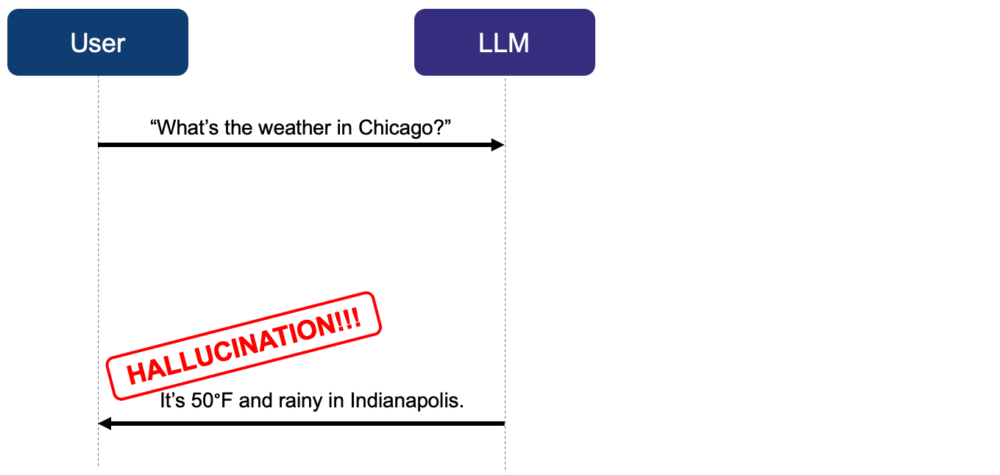

# Deconstructing agents {#sec-agents}

An [agent](https://en.wikipedia.org/wiki/AI_agent) is an artificial intelligence system that interacts with its environment, pursues goals, and takes actions.
Because agents rely on [large language models](https://en.wikipedia.org/wiki/Large_language_model), they are vulnerable to bizarre unpredictable errors called [hallucinations](https://en.wikipedia.org/wiki/Hallucination_(artificial_intelligence)).
To develop an agent that controls hallucinations, we first need to understand the relevant components of agents and how they work together.
This chapter describes these concepts and lays the groundwork for trusted mini-agents in later chapters. 

## Large language models are not agents.

By itself, a large language model is just a text-in/text-out machine learning model.
When generating predictions, an LLM has no ability to learn, no agency, and no ability to make decisions.
It only predicts lexical "tokens" similarly to how a simple linear regression model predicts new outcomes on a new dataset.

No statistical model makes perfect predictions, which is why LLMs [hallucinate](https://en.wikipedia.org/wiki/Hallucination_(artificial_intelligence)).
For example, suppose an LLM makes a prediction on this new dataset: "What's the weather in Chicago?"
The LLM blindly pattern-matches text to accompany the new data, and this prediction could be wrong.

## Agent = LLM + harness

At the implementation level, an agent is an LLM combined with a ["harness"](https://www.langchain.com/blog/the-anatomy-of-an-agent-harness).
The [harness](https://www.langchain.com/blog/the-anatomy-of-an-agent-harness) is the non-AI computing infrastructure that surrounds the LLM: the chat interface, the conversation history, long-term memory files, the [agent loop](https://code.claude.com/docs/en/agent-sdk/agent-loop), and above all, tools.

## Tools: the essence of agents

A tool is a classic non-AI capability that the LLM can ask the harness to call.
Tools empower the agent to perceive the world and act on it.
Structrually, [a tool is a function combined with metadata.](https://youtu.be/ctc2kx3LxG8?t=2138)

$$
\begin{aligned}
\text{Tool} = \text{Function} + \text{Metadata}
\end{aligned}
$$

A function is a transformation from structured inputs to structured outputs, such as a system library, R function, API, or script file.
The metadata is a set of instructions in the system prompt that tells the LLM when and how to call the function.
When the LLM decides it needs the tool, it "predicts" a call to the function using AI-generated arguments.
The agent loop (example: [Claude Code's agent loop](https://code.claude.com/docs/en/agent-sdk/agent-loop)) in the harness detects and runs the tool call, then returns the results back to the LLM.
With tool output, the LLM can incorporate real-world data into its text predictions.

For example, suppose we have a tool that scrapes the National Weather Service (NWS) API.
We write an R function `get_weather()`, and we include metadata to describe its inputs, outputs, and purpose.
This metadata becomes part of the instructions in the system prompt.
Because of these instructions, when the user prompts:

> "What's the weather in Chicago?"

the LLM may decide to predict the string:

> get_weather(41.8, -87.6)

This reply is a text prediction like any other LLM prediction.
Its components "get_weather", "41.8", and "-87.6" are AI-generated.
However, this string also has a special structure that the harness recognizes as a tool call.^["get_weather(41.8, -87.6)" is an oversimplification. A real agent may require a more complicated string that fits a formal JSON schema.]
The [agent loop](https://code.claude.com/docs/en/agent-sdk/agent-loop) detects and runs the tool call, then returns the tool output (i.e. the real weather data) to the LLM.
This weather data may inform the LLM's next prediction.

