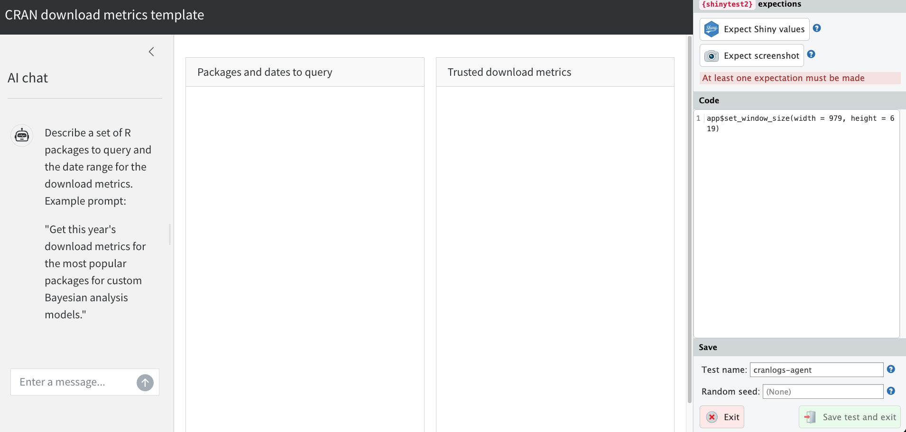
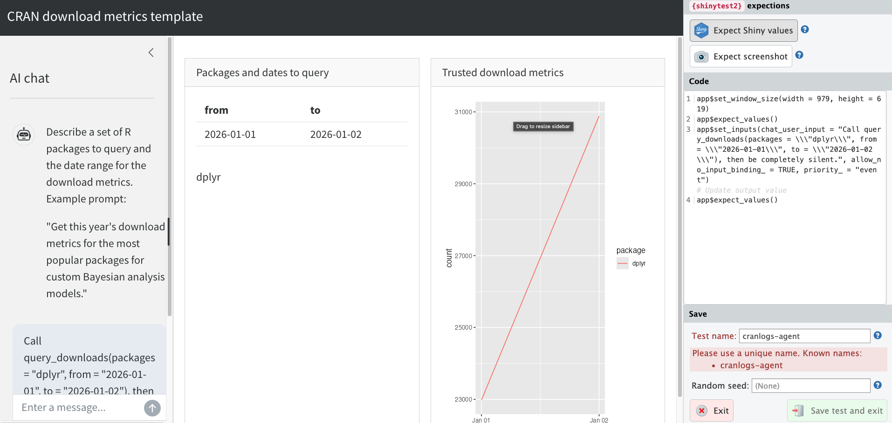

# A motivating example: CRAN download metrics {#sec-downloads}

Trusted mini-agents are not just for retrieving weather data.
They are versatile systems with a wide range of practical uses in the real world.
In this chapter, we present a motivating example of a trusted mini-agent that queries download metrics for [R packages](https://r-pkgs.org/) on [CRAN](https://cran.r-project.org/).
It is a simple computation, but the same strategy applies to advanced computations such as statistical modeling, analysis, and simulation.

The inspiration comes from [Hadley Wickham](https://hadley.nz/)'s [CRAN download viewer](https://hadley.shinyapps.io/cran-downloads/) where users input package names and the app displays metrics.
As explained below, the contribution of the LLM is to free users to think in terms of domains of packages instead of individual package names.

## How it works

The app interface looks like this:


The human user describes a set of packages and a date range to query.
Example prompt:

> I want to compare the popularity of R packages for Bayesian statistics.
> Give me this year's downloads for the most well-known Bayesian modeling packages.

The job of the AI is to translate human intent into specific packages and dates.
The LLM does not have enough information to do this on its own, so it loops over tools to scrape [CRAN task veiws](https://cran.r-project.org/web/views/) and get the current date.
This [agent loop](https://code.claude.com/docs/en/agent-sdk/agent-loop) is the upstream untrusted part of the workflow.
It has no human oversight, but that's okay: only *trusted* tools producing final results need oversight.
Until then, the LLM can flow freely and autonomously to devise insightful inputs to *trusted* tools.

Ultimately, the LLM lands on a set of packages and dates, and it shows these findings to the human user.
The user reviews the LLM-generated packages and dates, and then a trusted tool actually scrapes and plots the downloads.

The LLM-generated package list is a major convenience.
Humans can check the list more easily than writing it from scratch.
Describing general intent in a prompt is much easier for a human than spelling out every little detail.

The LLM may hallucinate packages, but hallucinated download metrics are structurally impossible.
The question is no longer "do we trust these metrics?", but instead "are these the packages we want to query?"
This matters because humans can check package names much more easily than download statistics.

CRAN downloads may seem trivial, but the same general idea applies to complex problems in statistics and data science.
Faced with a daunting model, analysis, or simulation, the LLM helps the human structure and formalize the task at hand.
Manual human inspection is not enough to judge the correctness of the final results, but humans can judge how well the LLM framed the problem.
Trust in the results comes from (1) trust in the tools, and (2) trust that the agent actually used those tools.

## Implementation

We begin by defining a tool constructor to scrape CRAN download metrics using the [cranlogs](https://cran.r-project.org/package=cranlogs) package.
As in the weather agent, the tool populates a list of Shiny reactive values which lives in the closure of the inner function.
When those reactive values update, the reactive expressions in the Shiny app automatically refresh the displayed results.

```{.r}
new_query_tool <- function(values) {
  ellmer::tool(
    fun = function(packages, from, to) {
      data <- cranlogs::cran_downloads(packages, from = from, to = to)
      values$packages <- packages
      values$dates <- data.frame(from = from, to = to)
      values$downloads <- ggplot2::ggplot(data) +
        ggplot2::geom_line(ggplot2::aes(x = date, y = count, color = package))
      ellmer::ContentToolResult("The download metrics have been plotted.")
    },
    name = "query_downloads",
    description = paste(
      "Query CRAN download metrics for a set of R packages.",
      "Before getting the 'from' and 'to' dates, you must",
      "use the current_time tool to get the current date and time."
    ),
    arguments = list(
      packages = ellmer::type_array(
        ellmer::type_string(description = "The name of an R package."),
        description = "A vector of R package names to query."
      ),
      from = ellmer::type_string(
        description = "The yyyy-mm-dd start date for the download metrics query."
      ),
      to = ellmer::type_string(
        description = "The yyyy-mm-dd end date for the download metrics query."
      )
    )
  )
}
```

To help the agent find appropriate packages to query, we define a `cran_task_view` tool that scrapes the [CRAN task views](https://cran.r-project.org/web/views/) and returns a list of packages for a given task view.
This is an untrusted tool, but that's okay because it doesn't produce any final results.
The goal is convenience, not correctness.

```{.r}
task_view_tool <- ellmer::tool(
  fun = function(topic) {
    base_url <- "https://cran.r-project.org/web/views/"
    index <- rvest::read_html(base_url)
    rows <- rvest::html_elements(index, "table tr")[-1]
    views <- data.frame(
      name = rvest::html_text2(rvest::html_element(rows, "a")),
      description = rvest::html_text2(
        rvest::html_elements(rows, "td:nth-child(2)")
      )
    )
    pattern <- paste(strsplit(topic, "\\s+")[[1]], collapse = "|")
    matches <- views[
      grepl(pattern, views$name, ignore.case = TRUE) |
        grepl(pattern, views$description, ignore.case = TRUE),
    ]
    if (nrow(matches) == 0L) {
      return(paste0(
        "No CRAN task views matched the topic '",
        topic,
        "'. ",
        "Available views: ",
        paste(views$name, collapse = ", ")
      ))
    }
    results <- lapply(matches$name, function(view_name) {
      page <- rvest::read_html(paste0(base_url, view_name, ".html"))
      pkgs <- rvest::html_text2(
        rvest::html_elements(page, "a[href*='packages'] span.CRAN")
      )
      pkgs <- sort(unique(setdiff(pkgs, "ctv")))
      pkgs <- pkgs[!grepl("(archived)", pkgs, fixed = TRUE)]
      list(
        view = view_name,
        description = matches$description[
          matches$name == view_name
        ],
        packages = pkgs
      )
    })
    lines <- vapply(
      results,
      function(r) {
        paste0(
          "Task View: ",
          r$view,
          " (",
          r$description,
          ")\n",
          "Packages (",
          length(r$packages),
          "): ",
          paste(r$packages, collapse = ", ")
        )
      },
      character(1)
    )
    paste(lines, collapse = "\n\n")
  },
  name = "cran_task_view",
  description = paste(
    "Search CRAN Task Views to find R packages related to a topic.",
    "Task views are curated lists of packages for specific domains",
    "(e.g. Bayesian, Spatial, TimeSeries, MachineLearning).",
    "Use this tool to discover relevant packages when the user",
    "asks about packages for a particular area of analysis."
  ),
  arguments = list(
    topic = ellmer::type_string(
      description = paste(
        "A keyword or short phrase describing the domain of interest",
        "(e.g. 'Bayesian', 'spatial', 'time series', 'machine learning').",
        "This is a grep pattern that will be matched against",
        "the names and descriptions of available task views."
      )
    )
  )
)
```

And to help the agent determine the correct date range, we also define a `current_time` tool that returns the current date and time.

```{.r}
current_time <- ellmer::tool(
  fun = Sys.time,
  name = "current_time",
  description = "Get the current date and time."
)
```

The `ellmer` chat object registers all these tools.

```{.r}
new_chat <- function(values) {
  chat <- ellmer::chat_anthropic(
    system_prompt = paste(
      "You are a software developer familiar with the R package ecosystem.",
      "The user describes a topic or area of interest, and you use the",
      "cran_task_view tool to discover relevant R packages.",
      "Then you query download metrics for those packages.",
      "If the user does not specify exact packages, use the task view tool",
      "to identify popular packages in their area of interest first."
    )
  )
  chat$register_tool(new_query_tool(values))
  chat$register_tool(current_time)
  chat$register_tool(task_view_tool)
  chat
}
```

The user interface has the usual three regions of trust: the chat window where output is never trusted, a review window for the human user to check LLM-generated packages and dates, and a designated region where download results are trusted given human-verified inputs.

```{.r}
ui <- bslib::page_sidebar(
  title = "CRAN download metrics agent",
  theme = bslib::bs_theme(bootswatch = "cosmo"),
  sidebar = bslib::sidebar(
    title = "AI chat",
    shinychat::chat_ui(
      "chat",
      messages = paste(
        "Describe a set of R packages to query",
        "and the date range for the download metrics. Example prompt:\n\n",
        "\"Get this year's download metrics for the most popular packages",
        "for custom Bayesian analysis models.\""
      )
    )
  ),
  bslib::layout_columns(
    bslib::card(
      bslib::card_header("Packages and dates to query"),
      bslib::card_body(
        shiny::tableOutput("dates"),
        shiny::textOutput("packages")
      )
    ),
    bslib::card(
      bslib::card_header("Trusted download metrics"),
      bslib::card_body(
        shiny::plotOutput("downloads")
      )
    )
  )
)
```

Finally, the server function coordinates the chat, reactive values, and Shiny outputs.

```{.r}
server <- function(input, output, session) {
  values <- shiny::reactiveValues(
    packages = NULL,
    dates = NULL,
    downloads = NULL
  )
  chat <- new_chat(values)
  shiny::observeEvent(input$chat_user_input, {
    stream <- chat$stream_async(input$chat_user_input, stream = "content")
    shinychat::chat_append("chat", stream)
  })
  output$dates <- shiny::renderTable({
    req(values$dates)
    values$dates
  })
  output$packages <- shiny::renderText({
    shiny::req(values$packages)
    paste(values$packages, collapse = ", ")
  })
  output$downloads <- shiny::renderPlot({
    req(values$downloads)
    values$downloads
  })
}
```

## Full app code

```{.r}
new_query_tool <- function(values) {
  ellmer::tool(
    fun = function(packages, from, to) {
      data <- cranlogs::cran_downloads(packages, from = from, to = to)
      values$packages <- packages
      values$dates <- data.frame(from = from, to = to)
      values$downloads <- ggplot2::ggplot(data) +
        ggplot2::geom_line(ggplot2::aes(x = date, y = count, color = package))
      ellmer::ContentToolResult("The download metrics have been plotted.")
    },
    name = "query_downloads",
    description = paste(
      "Query CRAN download metrics for a set of R packages.",
      "Before getting the 'from' and 'to' dates, you must",
      "use the current_time tool to get the current date and time."
    ),
    arguments = list(
      packages = ellmer::type_array(
        ellmer::type_string(description = "The name of an R package."),
        description = "A vector of R package names to query."
      ),
      from = ellmer::type_string(
        description = "The yyyy-mm-dd start date for the download metrics query."
      ),
      to = ellmer::type_string(
        description = "The yyyy-mm-dd end date for the download metrics query."
      )
    )
  )
}

task_view_tool <- ellmer::tool(
  fun = function(topic) {
    base_url <- "https://cran.r-project.org/web/views/"
    index <- rvest::read_html(base_url)
    rows <- rvest::html_elements(index, "table tr")[-1]
    views <- data.frame(
      name = rvest::html_text2(rvest::html_element(rows, "a")),
      description = rvest::html_text2(
        rvest::html_elements(rows, "td:nth-child(2)")
      )
    )
    pattern <- paste(strsplit(topic, "\\s+")[[1]], collapse = "|")
    matches <- views[
      grepl(pattern, views$name, ignore.case = TRUE) |
        grepl(pattern, views$description, ignore.case = TRUE),
    ]
    if (nrow(matches) == 0L) {
      return(paste0(
        "No CRAN task views matched the topic '",
        topic,
        "'. ",
        "Available views: ",
        paste(views$name, collapse = ", ")
      ))
    }
    results <- lapply(matches$name, function(view_name) {
      page <- rvest::read_html(paste0(base_url, view_name, ".html"))
      pkgs <- rvest::html_text2(
        rvest::html_elements(page, "a[href*='packages'] span.CRAN")
      )
      pkgs <- sort(unique(setdiff(pkgs, "ctv")))
      pkgs <- pkgs[!grepl("(archived)", pkgs, fixed = TRUE)]
      list(
        view = view_name,
        description = matches$description[
          matches$name == view_name
        ],
        packages = pkgs
      )
    })
    lines <- vapply(
      results,
      function(r) {
        paste0(
          "Task View: ",
          r$view,
          " (",
          r$description,
          ")\n",
          "Packages (",
          length(r$packages),
          "): ",
          paste(r$packages, collapse = ", ")
        )
      },
      character(1)
    )
    paste(lines, collapse = "\n\n")
  },
  name = "cran_task_view",
  description = paste(
    "Search CRAN Task Views to find R packages related to a topic.",
    "Task views are curated lists of packages for specific domains",
    "(e.g. Bayesian, Spatial, TimeSeries, MachineLearning).",
    "Use this tool to discover relevant packages when the user",
    "asks about packages for a particular area of analysis."
  ),
  arguments = list(
    topic = ellmer::type_string(
      description = paste(
        "A keyword or short phrase describing the domain of interest",
        "(e.g. 'Bayesian', 'spatial', 'time series', 'machine learning').",
        "This is a grep pattern that will be matched against",
        "the names and descriptions of available task views."
      )
    )
  )
)

current_time <- ellmer::tool(
  fun = Sys.time,
  name = "current_time",
  description = "Get the current date and time."
)

new_chat <- function(values) {
  chat <- ellmer::chat_anthropic(
    system_prompt = paste(
      "You are a software developer familiar with the R package ecosystem.",
      "The user describes a topic or area of interest, and you use the",
      "cran_task_view tool to discover relevant R packages.",
      "Then you query download metrics for those packages.",
      "If the user does not specify exact packages, use the task view tool",
      "to identify popular packages in their area of interest first."
    )
  )
  chat$register_tool(new_query_tool(values))
  chat$register_tool(current_time)
  chat$register_tool(task_view_tool)
  chat
}

ui <- bslib::page_sidebar(
  title = "CRAN download metrics agent",
  theme = bslib::bs_theme(bootswatch = "cosmo"),
  sidebar = bslib::sidebar(
    title = "AI chat",
    shinychat::chat_ui(
      "chat",
      messages = paste(
        "Describe a set of R packages to query",
        "and the date range for the download metrics. Example prompt:\n\n",
        "\"Get this year's download metrics for the most popular packages",
        "for custom Bayesian analysis models.\""
      )
    )
  ),
  bslib::layout_columns(
    bslib::card(
      bslib::card_header("Packages and dates to query"),
      bslib::card_body(
        shiny::tableOutput("dates"),
        shiny::textOutput("packages")
      )
    ),
    bslib::card(
      bslib::card_header("Trusted download metrics"),
      bslib::card_body(
        shiny::plotOutput("downloads")
      )
    )
  )
)

server <- function(input, output, session) {
  values <- shiny::reactiveValues(
    packages = NULL,
    dates = NULL,
    downloads = NULL
  )
  chat <- new_chat(values)
  shiny::observeEvent(input$chat_user_input, {
    stream <- chat$stream_async(input$chat_user_input, stream = "content")
    shinychat::chat_append("chat", stream)
  })
  output$dates <- shiny::renderTable({
    req(values$dates)
    values$dates
  })
  output$packages <- shiny::renderText({
    shiny::req(values$packages)
    paste(values$packages, collapse = ", ")
  })
  output$downloads <- shiny::renderPlot({
    req(values$downloads)
    values$downloads
  })
}

shiny::shinyApp(ui, server)
```

## Testing

We use expectation-based testing to ensure the app works.
We do not cover every possible test here, but we demonstrate the most important ones covering the tool function and the app itself.

We begin with the download metrics tool.
Tools are callable functions, which makes them easy to test.
Instead of a reactive values we use a temporary environment.
The [`vdiffr`](https://vdiffr.r-lib.org/) R package helps with regression testing on static plots.

```{.r file="tests/testthat/test-query_tool.R"}
test_that("the download query tool works.", {
  skip_if_offline()
  packages <- c("dplyr", "ggplot2")
  from <- "2024-01-01"
  to <- "2024-01-02"
  values <- new.env(parent = emptyenv())
  tool <- new_query_tool(values)
  expect_s3_class(tool, "ellmer_tool")
  tool(packages = packages, from = from, to = to)
  expect_equal(values$packages, c("dplyr", "ggplot2"))
  expect_equal(values$dates, data.frame(from = from, to = to))
  expect_s3_class(values$downloads, "data.frame")
  expect_named(values$downloads, c("date", "count", "package"))
  expect_equal(sort(unique(values$downloads$package)), sort(packages))
  expect_true(all(values$downloads$count >= 0))
  expect_equal(min(values$downloads$date), as.Date(from))
  expect_equal(max(values$downloads$date), as.Date(to))
  expect_equal(nrow(values$downloads), length(packages) * 2L)
})
```
To test the full app with `shinytest2`, we use a prompt that requests a specific past date range.
To set up the test:

* Run `shinytest2::record_test()`. A browser window will launch.



* Click "Expect Shiny values".
* Enter a prompt with specific past dates, such as: "Get download metrics for dplyr and ggplot2 from 2024-01-01 to 2024-01-07."
This tests the end-to-end flow of the LLM interaction, tool calling, and Shiny output.
* If a pop-up prompts you to record updates, click "Record".
* After the plot and package list populate, click "Expect Shiny values" again. At this point, you should see:



* Click "Save test and exit" on the lower right-hand side.

This creates a test file in `tests/testthat/` and a snapshot in `tests/testthat/_snaps/`.
Now, open the file in `tests/testthat/`.
Edit the file to add `app$wait_for_idle()` before each call to `app$expect_values()` to avoid race conditions with LLM streaming.
Example:

```{.r filename="tests/testthat/test-app.R"}
test_that("test the app", {
  app <- AppDriver$new(
    test_path("../.."),
    name = "app",
    height = 929,
    width = 1619
  )
  app$wait_for_idle()
  app$expect_values()
  app$set_inputs(
    chat_user_input = paste(
      "Get download metrics for dplyr and ggplot2",
      "from 2024-01-01 to 2024-01-07.",
      "Then be completely silent."
    ),
    allow_no_input_binding_ = TRUE,
    priority_ = "event"
  )
  app$wait_for_idle()
  app$expect_values()
})
```

Because the prompt specifies exact past dates, the resulting download counts are deterministic.
If a test failure occurs due to LLM variability in how it interprets the prompt, it can simply be retried.

To test the entire app, run `shinytest2::test_app()` from the root directory of the app.

```{.r}
> shinytest2::test_app()
✔ | F W  S  OK | Context
✔ |          5 | query_tool
✔ |          2 | shinytest2 [7.5s]

══ Results ════════════════════════════════════════════════
Duration: 8.3 s

[ FAIL 0 | WARN 0 | SKIP 0 | PASS 7 ]
```
