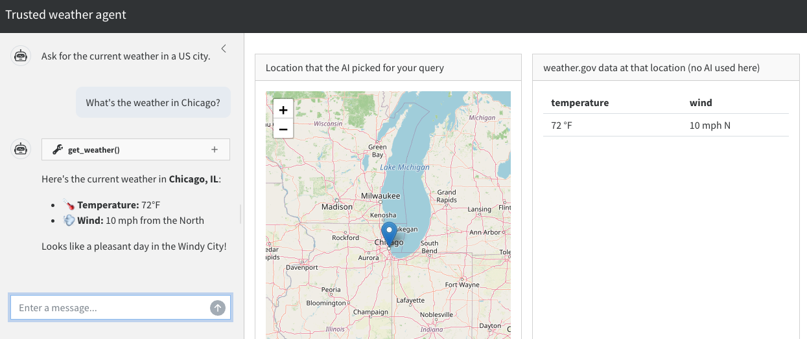

# Example: weather agent {#sec-weather-py}

This chapter builds on the template in [the previous chapter](py-template.qmd) and shows how to add tools to a trusted mini-agent in a Shiny for Python app.
We use the same weather agent idea as [the R version of this chapter](r-weather.qmd) to make the discussion concrete.
By the end of the chapter, we will have a full working example of a trusted mini-agent, implemented entirely in Python.

## Overview

This is the appearance of the app we will build.



In the `shinychat` interface on the left, the user asks for the weather in a US city.
The [`ipyleaflet`](https://ipyleaflet.readthedocs.io/en/latest/) map in the middle lets the user easily check if the AI-generated coordinates for the city are correct.
Trustworthy weather data is displayed on the right.

It is important to emphasize how the user interface separates the untrusted conversation with the AI model on the left from the trusted weather data on the right.
The AI-reported weather in the chat may be erroneous, and the user should not rely on it.
The weather data on the right, however, is trustworthy because:

1. We guarantee it comes from a trusted tool (`get_weather()`).
2. The map in the middle is super easy to check, so we can be confident the app is checking the weather in the right place.

## App design

The following diagram demonstrates the flow of control in the weather app we are about to build.
It is the same trust structure as [the R weather agent](r-weather.qmd#app-design), just with Python components.

```{mermaid}
flowchart LR
  subgraph Untrusted due to the model
    U["User input"] --> C["shinychat UI"]
    C --> U
    C --> L[chatlas chat]
    L --> Model
    Model --> L
    L --> C
  end
  subgraph Trusted due to testing
    L --> T["get_weather()"]
    T --> RV["reactive.Value:<br>lat, long, weather"]
  end
  subgraph Trusted on good inputs
    RV --> W["Weather data"]
  end
  subgraph Human oversight
    RV --> M["ipyleaflet map of<br>model-generated lat and long"]
  end
```

The user enters a prompt into the [`shinychat`](https://posit-dev.github.io/shinychat/py/) UI, and there is a flow of conversation between the user and the AI model.
At its discretion, the AI model sends [`chatlas`](https://posit-dev.github.io/chatlas/) the text for a tool call (e.g. `get_weather(41.8, -87.6)`), at which point [`chatlas`](https://posit-dev.github.io/chatlas/) runs the tool call instead of simply relaying the text back to [`shinychat`](https://posit-dev.github.io/shinychat/py/).

`get_weather()` is a function that accepts a pair of geographic coordinates and returns the location and its weather to a [`reactive.Value()`](https://shiny.posit.co/py/api/core/reactive.Value.html).
**Crucially, `get_weather()` is the only thing that can write to that reactive value.**
**This constraint enforces rule 2 (injectivity) of trusted mini-agents.**
Neither the user nor the AI model can update that reactive value any other way.

The map renders the coordinates the AI model picked, so the user can check whether its resolution of the query looks correct.
If the `get_weather()` tool is correct and the map points to the right location, then AI-generated errors in the weather data are structurally impossible.

## Weather API function

Our agent relies on an internal Python function that accepts geographic coordinates and returns weather data.
This is a simple function that the agentic tool will eventually call.


```{.python}
import os
from datetime import datetime, timezone

import httpx2


def weather_api(latitude: float, longitude: float) -> dict:
    """Fetch current weather at a US location.

    Fetches the current (or nearest-to-current) forecast period from the
    U.S. National Weather Service API
    (https://www.weather.gov/documentation/services-web-api). The NWS API
    is free, requires no API key, and only covers locations in the United
    States.

    A two-step lookup is required:
        1. GET /points/{lat},{lon}  -> returns a URL for the gridded forecast
        2. GET that forecast URL    -> returns the forecast periods
    A descriptive User-Agent is required by api.weather.gov. The NWS
    forecast endpoint returns a sequence of upcoming periods (e.g.
    "This Afternoon", "Tonight", "Tomorrow"). This function selects the
    first period whose time window contains the current time, falling
    back to the earliest period if none currently apply.

    Args:
        latitude: Latitude in decimal degrees, between -90 and 90.
        longitude: Longitude in decimal degrees, between -180 and 180.

    Returns:
        A dict with the temperature and wind at the specified latitude
        and longitude. Raises an error if the coordinates are outside
        the NWS coverage area.
    """
    # Assertions are critical for any agent tool.
    assert isinstance(latitude, (int, float)) and not isinstance(latitude, bool)
    assert isinstance(longitude, (int, float)) and not isinstance(longitude, bool)
    assert -90 <= latitude <= 90
    assert -180 <= longitude <= 180

    # Mock hook for pytest + shiny's testing tools: when MOCK_WEATHER is
    # set, return a stable fixture instead of calling the live NWS API.
    # This keeps end-to-end tests deterministic.
    if os.environ.get("MOCK_WEATHER"):
        return {"temperature": "72 \u00b0F", "wind": "5 mph SW"}

    user = "mini-agent (mini-agent; contact: noreply@example.com)"
    headers = {"User-Agent": user, "Accept": "application/geo+json"}
    transport = httpx2.HTTPTransport(retries=3)
    with httpx2.Client(headers=headers, transport=transport) as client:
        # Step 1: resolve the (lat, lon) to an NWS gridpoint.
        points_url = f"https://api.weather.gov/points/{latitude:.4f},{longitude:.4f}"
        points = client.get(points_url).raise_for_status().json()
        # Step 2: fetch the forecast periods for that gridpoint.
        forecast_url = points["properties"]["forecast"]
        forecast = client.get(forecast_url).raise_for_status().json()

    periods = forecast["properties"]["periods"]
    # Pick the period that covers "now".
    now = datetime.now(timezone.utc)
    current = periods[0]
    for period in periods:
        start = datetime.fromisoformat(period["startTime"])
        end = datetime.fromisoformat(period["endTime"])
        if start <= now <= end:
            current = period
            break

    return {
        "temperature": f"{current['temperature']} \u00b0{current['temperatureUnit']}",
        "wind": f"{current['windSpeed']} {current['windDirection']}",
    }
```

## Weather tool constructor

We write `get_weather()` as a plain Python function that [`chatlas`](https://posit-dev.github.io/chatlas/get-started/tools.html) can register as a tool, but with a twist: instead of a free-standing function, we write a tool constructor that accepts a Shiny `reactive.Value()` holding the weather state and instantiates a tool tied to that reactive value.
The tool can access `values` because `values` is inside the [closure](https://docs.python.org/3/reference/datamodel.html) of the inner function.

```{.python}
from shiny import reactive


def new_weather_tool(values: reactive.Value):
    """Create a weather tool for `chatlas`.

    Args:
        values: A Shiny `reactive.Value` holding a dict with weather data.
            The weather tool updates this reactive value, and it is the
            ONLY thing that can update it.
            This restriction is essential for a trusted mini-agent.

    Returns:
        A plain Python function suitable for `chat.register_tool()`.
    """

    def get_weather(latitude: float, longitude: float) -> str:
        """Get the current weather forecast for a location in the United
        States, given its latitude and longitude in decimal degrees.
        The tool only approximates the current weather, not past weather
        or distant future forecasts. Only call this tool for U.S.
        locations. The underlying National Weather Service API does not
        cover other countries.

        Args:
            latitude: Latitude in decimal degrees. Must be between -90 and 90.
            longitude: Longitude in decimal degrees. Must be between -180 and 180.
        """
        weather = weather_api(latitude, longitude)
        values.set({"latitude": latitude, "longitude": longitude, "weather": weather})
        return str(weather)

    return get_weather
```

## Leaflet map

The map helps the user check the correctness of AI-generated location data.
It accepts geographic coordinates and renders a map with a marker dropped at that location, using [`ipyleaflet`](https://ipyleaflet.readthedocs.io/en/latest/).

```{.python}
from ipyleaflet import Map, Marker


def leaflet_map(latitude: float, longitude: float, zoom: int = 6) -> Map:
    """Build a leaflet map centered on a US location.

    Construct an OpenStreetMap-tiled `ipyleaflet` widget centered on the
    supplied latitude and longitude with a single marker dropped at that
    point. Used by the trusted weather agent app to let users visually
    verify that the AI-resolved coordinates land in the region they asked
    about.

    Args:
        latitude: Latitude in decimal degrees, between -90 and 90.
        longitude: Longitude in decimal degrees, between -180 and 180.
        zoom: Leaflet zoom level: lower values are zoomed further out,
            higher values are zoomed in tighter.

    Returns:
        An `ipyleaflet.Map` widget with a marker at the given coordinates.
    """
    location = (latitude, longitude)
    map_widget = Map(center=location, zoom=zoom)
    map_widget.add(Marker(location=location))
    return map_widget
```

## Chat constructor with tool registration

As before, we write a constructor for the chat client.
This time, however, there is an extra step to create a new weather tool with a given reactive value, then register the new tool with the chat client.

```{.python}
from chatlas import ChatAnthropic
from dotenv import load_dotenv

load_dotenv()


def new_chat(values: reactive.Value):
    chat = ChatAnthropic(
        system_prompt=(
            "You are a concise assistant that knows how to translate vague "
            "location information into latitude and longitude coordinates."
        )
    )
    chat.register_tool(new_weather_tool(values))
    return chat
```

## App UI

The app UI has three main components: an untrusted `shinychat` UI for the conversation, an `ipyleaflet` output for the map for human review, and a trusted table output for the weather data.
**Remember: because of the three levels of trust, these components should be in separate UI elements.**
It should be clear to the user that trusted output comes from the weather table, not from the chat.

```{.python}
from shiny import ui
from shinychat import chat_ui
from shinywidgets import output_widget

app_ui = ui.page_sidebar(
    ui.sidebar(
        chat_ui("chat", messages=["Ask for the current weather in a US city."]),
        width="30vw",
        style="height: 100%; padding-top: 15px; overflow-x: hidden;",
    ),
    ui.layout_columns(
        ui.card(
            ui.card_header("Location that the AI picked for your query"),
            ui.card_body(output_widget("location")),
        ),
        ui.card(
            ui.card_header("weather.gov data at that location (no AI used here)"),
            ui.card_body(ui.output_table("weather")),
        ),
    ),
    title="Trusted weather agent",
)
```

## Server function

The server function defines a reactive value for the weather results and geographic coordinates.
The chat client is created with that reactive value, and there is a handler for user submissions plus render functions for the map and weather table.

```{.python}
import pandas as pd
from shiny import render, req
from shinywidgets import render_widget


def server(input, output, session):
    values = reactive.Value(None)
    chat_client = new_chat(values)
    chat = Chat("chat")

    @chat.on_user_submit
    async def handle_user_input(user_input: str):
        response = await chat_client.stream_async(user_input)
        await chat.append_message_stream(response)

    @render_widget
    def location():
        state = values.get()
        req(state)
        return leaflet_map(state["latitude"], state["longitude"])

    @render.table
    def weather():
        state = values.get()
        req(state)
        return pd.DataFrame([state["weather"]])
```

## Complete app code

Here is the full code for the app.

```{.python filename="app.py"}
import os
from datetime import datetime, timezone

import httpx2
import pandas as pd
from chatlas import ChatAnthropic
from dotenv import load_dotenv
from ipyleaflet import Map, Marker
from shiny import App, reactive, render, req, ui
from shinychat import Chat, chat_ui
from shinywidgets import output_widget, render_widget

load_dotenv()

def weather_api(latitude: float, longitude: float) -> dict:
    """Fetch current weather at a US location.

    Fetches the current (or nearest-to-current) forecast period from the
    U.S. National Weather Service API
    (https://www.weather.gov/documentation/services-web-api). The NWS API
    is free, requires no API key, and only covers locations in the United
    States.

    Args:
        latitude: Latitude in decimal degrees, between -90 and 90.
        longitude: Longitude in decimal degrees, between -180 and 180.

    Returns:
        A dict with the temperature and wind at the specified latitude
        and longitude. Raises an error if the coordinates are outside
        the NWS coverage area.
    """
    # Assertions are critical for any agent tool.
    assert isinstance(latitude, (int, float)) and not isinstance(latitude, bool)
    assert isinstance(longitude, (int, float)) and not isinstance(longitude, bool)
    assert -90 <= latitude <= 90
    assert -180 <= longitude <= 180

    # Mock hook for testing: when MOCK_WEATHER is set, return a stable
    # fixture instead of calling the live NWS API. This keeps end-to-end
    # tests deterministic.
    if os.environ.get("MOCK_WEATHER"):
        return {"temperature": "72 \u00b0F", "wind": "5 mph SW"}

    user = "mini-agent (mini-agent; contact: noreply@example.com)"
    headers = {"User-Agent": user, "Accept": "application/geo+json"}
    transport = httpx2.HTTPTransport(retries=3)
    with httpx2.Client(headers=headers, transport=transport) as client:
        points_url = f"https://api.weather.gov/points/{latitude:.4f},{longitude:.4f}"
        points = client.get(points_url).raise_for_status().json()
        forecast_url = points["properties"]["forecast"]
        forecast = client.get(forecast_url).raise_for_status().json()

    periods = forecast["properties"]["periods"]
    now = datetime.now(timezone.utc)
    current = periods[0]
    for period in periods:
        start = datetime.fromisoformat(period["startTime"])
        end = datetime.fromisoformat(period["endTime"])
        if start <= now <= end:
            current = period
            break

    return {
        "temperature": f"{current['temperature']} \u00b0{current['temperatureUnit']}",
        "wind": f"{current['windSpeed']} {current['windDirection']}",
    }


def new_weather_tool(values: reactive.Value):
    """Create a weather tool for `chatlas`.

    Args:
        values: A Shiny `reactive.Value` holding a dict with weather data.
            The weather tool updates this reactive value, and it is the
            ONLY thing that can update it.
            This restriction is essential for a trusted mini-agent.
    """

    def get_weather(latitude: float, longitude: float) -> str:
        """Get the current weather forecast for a location in the United
        States, given its latitude and longitude in decimal degrees.
        The tool only approximates the current weather, not past weather
        or distant future forecasts. Only call this tool for U.S.
        locations. The underlying National Weather Service API does not
        cover other countries.

        Args:
            latitude: Latitude in decimal degrees. Must be between -90 and 90.
            longitude: Longitude in decimal degrees. Must be between -180 and 180.
        """
        weather = weather_api(latitude, longitude)
        values.set({"latitude": latitude, "longitude": longitude, "weather": weather})
        return str(weather)

    return get_weather


def leaflet_map(latitude: float, longitude: float, zoom: int = 6) -> Map:
    """Build a leaflet map centered on a US location.

    Args:
        latitude: Latitude in decimal degrees, between -90 and 90.
        longitude: Longitude in decimal degrees, between -180 and 180.
        zoom: Leaflet zoom level: lower values are zoomed further out,
            higher values are zoomed in tighter.
    """
    location = (latitude, longitude)
    map_widget = Map(center=location, zoom=zoom)
    map_widget.add(Marker(location=location))
    return map_widget


def new_chat(values: reactive.Value):
    chat = ChatAnthropic(
        system_prompt=(
            "You are a concise assistant that knows how to translate vague "
            "location information into latitude and longitude coordinates."
        )
    )
    chat.register_tool(new_weather_tool(values))
    return chat


app_ui = ui.page_sidebar(
    ui.sidebar(
        chat_ui("chat", messages=["Ask for the current weather in a US city."]),
        width="30vw",
        style="height: 100%; padding-top: 15px; overflow-x: hidden;",
    ),
    ui.layout_columns(
        ui.card(
            ui.card_header("Location that the AI picked for your query"),
            ui.card_body(output_widget("location")),
        ),
        ui.card(
            ui.card_header("weather.gov data at that location (no AI used here)"),
            ui.card_body(ui.output_table("weather")),
        ),
    ),
    title="Trusted weather agent",
)


def server(input, output, session):
    values = reactive.Value(None)
    chat_client = new_chat(values)
    chat = Chat("chat")

    @chat.on_user_submit
    async def handle_user_input(user_input: str):
        response = await chat_client.stream_async(user_input)
        await chat.append_message_stream(response)

    @render_widget
    def location():
        state = values.get()
        req(state)
        return leaflet_map(state["latitude"], state["longitude"])

    @render.table
    def weather():
        state = values.get()
        req(state)
        return pd.DataFrame([state["weather"]])


app = App(app_ui, server)
```

## Testing

We use expectation-based testing to ensure the app works, using [`pytest`](https://docs.pytest.org/en/stable/) and Shiny's [testing tools](https://shiny.posit.co/py/docs/end-to-end-testing.html).
We do not cover every possible test here, but we demonstrate the most important ones covering the tool function and the app itself.

We begin with the `weather_api()` function.
The weather changes over time, but we can still test that the function returns data in the expected format and that it correctly handles invalid input.
Examples:

```{.python filename="tests/test_weather_api.py"}
import re

import pytest

from app import weather_api


def test_weather_api_returns_sensible_response_from_live_nws_api():
    weather = weather_api(latitude=39.7684, longitude=-86.1581)
    assert re.match(r"^-?[0-9]+ \u00b0[FC]$", weather["temperature"])
    temperature_value = float(re.sub(r" \u00b0[FC]$", "", weather["temperature"]))
    assert -40 <= temperature_value <= 130
    assert "mph" in weather["wind"]


@pytest.mark.parametrize(
    "latitude, longitude",
    [
        ("39", -86),
        (39, "abc"),
        (91, 0),
        (-91, 0),
        (0, 181),
        (0, -181),
        (float("nan"), 0),
    ],
)
def test_weather_api_rejects_invalid_coordinates(latitude, longitude):
    with pytest.raises(AssertionError):
        weather_api(latitude=latitude, longitude=longitude)
```

The weather is always changing, so `weather_api()` will return different values at different times.
This poses a problem for other types of tests, which is why `weather_api()` checks an environment variable that lets us mock the API response with a stable fixture:

```{.python filename="app.py"}
    # Mock hook for testing: when MOCK_WEATHER is set, return a stable
    # fixture instead of calling the live NWS API. This keeps end-to-end
    # tests deterministic.
    if os.environ.get("MOCK_WEATHER"):
        return {"temperature": "72 \u00b0F", "wind": "5 mph SW"}
```

To test the mocking, we write:

```{.python filename="tests/test_weather_api.py"}
def test_weather_api_returns_mocked_fixture_when_mock_weather_is_set(monkeypatch):
    monkeypatch.setenv("MOCK_WEATHER", "true")
    weather = weather_api(latitude=39.7684, longitude=-86.1581)
    assert weather == {"temperature": "72 \u00b0F", "wind": "5 mph SW"}
```

Mocking allows us to test the rest of the app in a near-deterministic way with Shiny's [`playwright`](https://playwright.dev/python/)-based end-to-end testing tools.
An example test, run with `MOCK_WEATHER` set, drives the chat input and waits for the map and table to populate:

```{.python filename="tests/test_app.py"}
from playwright.sync_api import Page
from shiny.playwright import controller
from shiny.run import ShinyAppProc
from shinychat.playwright import ChatController


def test_weather_app(page: Page, app: ShinyAppProc):
    page.goto(app.url)

    chat = ChatController(page, "chat")
    chat.set_user_input(
        "Call get_weather(latitude=40, longitude=-80), then be completely silent."
    )
    chat.send_user_input()

    # Wait for the trusted table to populate from the tool call, not from
    # any text the model produced in the chat.
    weather_table = controller.OutputTable(page, "weather")
    weather_table.expect_cell("72 \u00b0F", row=1, col=1)
```

The `app` fixture above comes from `shiny.pytest`, which starts (and tears down) a local instance of `app.py` for the test to drive.
Since the app runs as a subprocess, set `MOCK_WEATHER` in `conftest.py` before the fixture starts it, not inside the test body, where it would be too late to take effect:

```{.python filename="tests/conftest.py"}
import os

os.environ["MOCK_WEATHER"] = "true"

from shiny.pytest import create_app_fixture

app = create_app_fixture("../app.py")
```

Since `app.py` and the `tests/` directory are siblings, add a `pyproject.toml` so `pytest` can resolve `from app import weather_api`:

```{.toml filename="pyproject.toml"}
[tool.pytest.ini_options]
pythonpath = ["."]
```

See `create_app_fixture()`'s [API reference](https://shiny.posit.co/py/api/testing/pytest.create_app_fixture.html) for other options, like reusing one running app across a test module or parametrizing over multiple app paths.
The tests require authentication into the AI model, but they can run without a visible browser window in headless mode.

```{.bash}
$ pytest
================= test session starts =================
collected 10 items

tests/test_app.py .                               [ 10%]
tests/test_weather_api.py .........                [100%]

================= 10 passed in 4.85s =================
```
