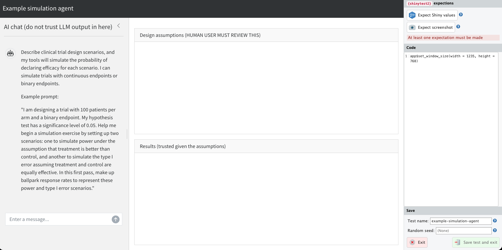
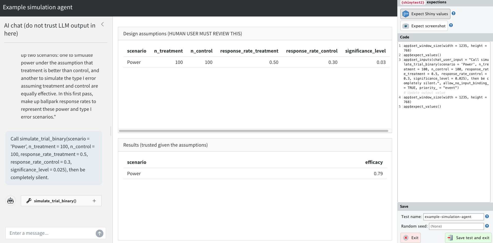

# Example: simulation {#sec-simulation}

Trusted mini-agents are not just for retrieving weather data.
They are versatile systems with a wide range of practical uses in the real world.
In this chapter, we present a motivating example of a trusted mini-agent for clinical trial simulation.

## How it works

The app interface looks like this:


The human user describes scenarios for a clinical trial design in natural language.
The AI model translates the human intent into rigorous simulation parameters.
The user reviews those assumptions in the table at the top.
If we trust the simulation code, and if the assumptions represent the design the user wants, then we can trust the results.

The AI model may generate erroneous scenarios, but those scenarios are easy for a human to check.
Given good scenarios, AI-generated errors in the results are structurally impossible.

This is where the trusted mini-agent pattern really shines.
The AI model makes the process of conceiving and tuning clinical trial designs more effortless and productive.
But because of the structure around the AI model, the question is no longer "do we trust these results?", it's "do these assumptions reflect the scenarios the user wants to simulate?"
That second question is much easier for human users to verify.

## App design

The following diagram demonstrates the flow of control in the simulation app we are about to build.

```{mermaid}
flowchart LR
  subgraph Untrusted due to the model
    U["User input"] --> C["shinychat UI"]
    C --> U
    C --> L[ellmer chat]
    L --> Model
    Model --> L
    L --> C
  end
  subgraph Trusted due to testing
    L --> TC["simulate_trial_continuous()"]
    L --> TB["simulate_trial_binary()"]
    TC --> RV["reactiveValues:<br>assumptions, results"]
    TB --> RV
  end
  subgraph Trusted on good inputs
    RV --> R["Results data"]
  end
  subgraph Human oversight
    RV --> A["Assumptions table of<br>model-generated trial scenarios"]
  end
```

The user enters a prompt into the [`shinychat`](https://posit-dev.github.io/shinychat/r/) UI, and there is a flow of conversation between the user and the AI model.
At its discretion, the AI model sends [`ellmer`](https://ellmer.tidyverse.org/) the text for a tool call (e.g. `simulate_trial_binary(...)`), at which point [`ellmer`](https://ellmer.tidyverse.org/) runs the tool call instead of simply relaying the text back to [`shinychat`](https://posit-dev.github.io/shinychat/r/).

The simulation tools run the statistical functions with the AI-supplied assumptions and write both the assumptions and the results to a [`reactiveValues()`](https://shiny.posit.co/r/reference/shiny/0.11/reactivevalues.html) list.
**Crucially, the simulation tools are the only things that can write to those `reactiveValues()` slots.**
The `reactiveValues()` list is just a repository: it can hold many different types of results, so multiple trusted tools — one per endpoint type — can deposit their outputs into it.
**This constraint still enforces rule 2 (injectivity) of trusted mini-agents.**
Each result that reaches the user originates from a designated, tested tool, never directly from the AI model or the user.

The assumptions table renders the AI-generated trial scenarios, so the user can check whether the AI model's translation of their query looks correct.
If the simulation tools are correct and the assumptions reflect the design the user wants, then AI-generated errors in the results are structurally impossible.

## Potential future work: empowering the agent

Modern agents don't just one-shot proposed ideas; they [loop](https://code.claude.com/docs/en/agent-sdk/agent-loop) over untrusted tools and take time to reason without interruption.
For example, extra tools could scrape [PubMed](https://pubmed.ncbi.nlm.nih.gov/) or [ClinicalTrials.gov](https://clinicaltrials.gov/) for relevant literature, and the queries could inform the simulation assumptions.
These tools don't strictly need oversight because they don't directly produce critical results; they only inform the AI model's reasoning.
Human oversight only needs to happen downstream, when inputs go into trusted tools that directly produce final results.

## Clinical trial simulation

Clinical trials are designed with statistical tradeoffs.
An ideal clinical trial shows evidence of safety and efficacy for safe and effective therapies, while rejecting therapies that are unsafe or ineffective, all while enrolling as few patients as possible.
Simulation allows clinical trial sponsors to evaluate these tradeoffs empirically.
In this section, we present two simple examples of trial simulation methods.
Later, we build each simulation type into a tool as part of a trusted mini-agent.

### Simulation 1: continuous endpoints

Suppose we design a parallel two-arm randomized controlled trial (RCT) to evaluate a new drug.
The outcome measure of the trial is a continuous measurement taken on each patient.
We use simulation to estimate the probability that the trial declares efficacy.

For each study arm (treatment and control), we assume values for the mean response, the standard deviation of responses, and the number of patients.
We simulate many trials by sampling patient responses from independent normal distributions, then we apply a frequentist hypothesis test to assess efficacy in each simulated trial.
The fraction of p-values below a given significance level is an estimate of the probability that the trial declares efficacy.

For simplicity, we fix the pseudo-random number generation seed and the number of simulations.
In real-world apps, these should be inputs just like `n_treatment` and `n_control`.
The `stopifnot()` assertions on the inputs are helpful for catching erroneous inputs before they even reach human eyes.

```{.r}
#' @title Simulate a two-arm randomized controlled trial
#'   with a continuous endpoint.
#' @description Estimates the probability that a parallel two-arm RCT declares
#'   efficacy for a continuous outcome. Patient responses are sampled from
#'   independent normal distributions, and a one-sided two-sample t-test
#'   is applied to each simulated trial. The returned value is an
#'   estimate of the probability that the trial declares efficacy
#'   under the supplied assumptions.
#' @return Numeric scalar between 0 and 1,
#'   the proportion of simulated trials that declare efficacy.
#' @param n_treatment Integer, number of patients in the treatment arm.
#' @param n_control Integer, number of patients in the control arm.
#' @param mean_treatment Numeric, true mean response in the treatment arm.
#' @param mean_control Numeric, true mean response in the control arm.
#' @param sd_treatment Positive numeric, standard deviation of responses in
#'   the treatment arm.
#' @param sd_control Positive numeric, standard deviation of responses in
#'   the control arm.
#' @param significance_level Numeric between 0 and 1, one-sided significance
#'   threshold for declaring efficacy.
#' @examples
#'   simulate_trial_continuous()
simulate_trial_continuous <- function(
  n_treatment = 100,
  n_control = 100,
  mean_treatment = 0.5,
  mean_control = 0,
  sd_treatment = 1,
  sd_control = 1,
  significance_level = 0.025
) {
  set.seed(0L)
  stopifnot(is.numeric(n_treatment), n_treatment > 0)
  stopifnot(is.numeric(n_control), n_control > 0)
  stopifnot(is.numeric(mean_treatment))
  stopifnot(is.numeric(mean_control))
  stopifnot(is.numeric(sd_treatment), sd_treatment > 0)
  stopifnot(is.numeric(sd_control), sd_control > 0)
  stopifnot(
    is.numeric(significance_level),
    significance_level > 0,
    significance_level < 1
  )
  p_values <- replicate(10000, {
    treatment <- rnorm(n_treatment, mean_treatment, sd_treatment)
    control <- rnorm(n_control, mean_control, sd_control)
    test <- t.test(treatment, control, alternative = "greater")
    test$p.value
  })
  mean(p_values < significance_level)
}
```

### Simulation 2: binary endpoints

Simulation 2 is similar, but the endpoint is binary: each patient either has a favorable outcome (a response) or an unfavorable one under the randomized regimen (treatment or control).
We simulate the number of responders in each arm from independent binomial distributions, then we apply a test of proportions to see if the treatment response rate is significantly higher than that of the control group.

```{.r}
#' @title Simulate a two-arm randomized controlled trial
#'   with a binary endpoint.
#' @description Estimates the probability that a parallel two-arm RCT declares
#'   efficacy for a binary outcome. The number of responders in each arm is
#'   sampled from independent binomial distributions, and a one-sided test of
#'   proportions is applied to each simulated trial. The returned value is an
#'   estimate of the probability that the trial declares efficacy
#'   under the supplied assumptions.
#' @return Numeric scalar between 0 and 1,
#'   the proportion of simulated trials that declare efficacy.
#' @param n_treatment Integer, number of patients in the treatment arm.
#' @param n_control Integer, number of patients in the control arm.
#' @param response_rate_treatment Numeric between 0 and 1, true probability
#'   of a favorable response in the treatment arm.
#' @param response_rate_control Numeric between 0 and 1, true probability
#'   of a favorable response in the control arm.
#' @param significance_level Numeric between 0 and 1, one-sided significance
#'   threshold for declaring efficacy.
#' @examples
#'   simulate_trial_binary()
simulate_trial_binary <- function(
  n_treatment = 100,
  n_control = 100,
  response_rate_treatment = 0.5,
  response_rate_control = 0.5,
  significance_level = 0.025
) {
  set.seed(0L)
  stopifnot(is.numeric(n_treatment), n_treatment > 0)
  stopifnot(is.numeric(n_control), n_control > 0)
  stopifnot(
    is.numeric(response_rate_treatment),
    response_rate_treatment >= 0,
    response_rate_treatment <= 1
  )
  stopifnot(
    is.numeric(response_rate_control),
    response_rate_control >= 0,
    response_rate_control <= 1
  )
  stopifnot(
    is.numeric(significance_level),
    significance_level > 0,
    significance_level < 1
  )
  p_values <- replicate(10000, {
    treatment <- rbinom(n_treatment, 1, response_rate_treatment)
    control <- rbinom(n_control, 1, response_rate_control)
    test <- prop.test(
      c(sum(treatment), sum(control)),
      c(n_treatment, n_control),
      alternative = "greater"
    )
    test$p.value
  })
  mean(p_values < significance_level)
}
```

## Tools

We write an `ellmer` tool constructor for each simulation type.
Each constructor accepts a Shiny reactive values list and returns an `ellmer` tool that can modify those reactive values.
We assume two reactive values: a table of assumptions that the user will check, and a table of efficacy probabilities computed by the statistical content of the tools.

Unlike the statistical functions above, these tools accept multiple design scenarios at a time.
This is key for evaluating trade-offs in real-world clinical trial simulations.
To accomplish this, we use a custom wrapper around `ellmer::type_array()`:

```{.r}
type_vector <- function(type) {
  ellmer::type_array(
    type,
    paste(
      "A vector defining multiple clinical trial",
      "design scenarios to simulate.",
      "Each element defines one scenario."
    )
  )
}
```

The tool constructor for continuous endpoints is as follows.
The `ellmer::ContentToolResult()` call at the end of the wrapper function sends the efficacy results back to the AI model.
Accessing the results helps the AI model think and reason, and it is for convenience only.
This output will also show up in the `shinychat` interface, but on sheer principle, users should not trust anything in the chat window.

```{.r}
#' @title Continuous endpoint trial simulation tool constructor.
#' @description Create a trial simulation tool for `ellmer` that estimates
#'   the probability of declaring efficacy in a two-arm RCT with a continuous
#'   endpoint. The tool runs `simulate_trial_continuous()` with the
#'   AI-supplied assumptions and writes the results to a Shiny
#'   `reactiveValues()` list.
#' @return An `ellmer` tool object that can be registered with
#'   an `ellmer` chat object.
#' @param values A Shiny `reactiveValues()` list. The tool writes two slots:
#'   `values$assumptions` (a one-row data frame of the assumptions used) and
#'   `values$efficacy_probability` (the Monte Carlo estimate). The tool is
#'   the ONLY thing that can update these reactive values. This restriction
#'   is essential for a trusted mini-agent.
new_continuous_tool <- function(values) {
  ellmer::tool(
    fun = function(
      scenario,
      n_treatment,
      n_control,
      mean_treatment,
      mean_control,
      sd_treatment,
      sd_control,
      significance_level
    ) {
      assumptions <- data.frame(
        n_treatment = n_treatment,
        n_control = n_control,
        mean_treatment = mean_treatment,
        mean_control = mean_control,
        sd_treatment = sd_treatment,
        sd_control = sd_control,
        significance_level = significance_level
      )
      efficacy <- purrr::pmap_dbl(assumptions, simulate_trial_continuous)
      results <- data.frame(scenario = scenario, efficacy = efficacy)
      values$assumptions <- cbind(scenario = scenario, assumptions)
      values$results <- results
      ellmer::ContentToolResult(
        paste(jsonlite::toJSON(results, digits = NA), collapse = "\n")
      )
    },
    name = "simulate_trial_continuous",
    description = paste(
      "Simulate a parallel two-arm randomized controlled trial",
      "with a continuous endpoint.",
      "Estimates the probability that the trial declares efficacy",
      "by sampling patient responses from independent normal distributions",
      "and applying a one-sided two-sample t-test to each simulated trial.",
      "Use this tool when the user asks about power, type I error,",
      "or the probability of success for a trial with a continuous outcome."
    ),
    arguments = list(
      scenario = ellmer::type_string(
        "Name of the clinical trial simulation scenario."
      ) |>
        type_vector(),
      n_treatment = ellmer::type_integer(
        "Number of patients in the treatment arm. Must be a positive integer."
      ) |>
        type_vector(),
      n_control = ellmer::type_integer(
        "Number of patients in the control arm. Must be a positive integer."
      ) |>
        type_vector(),
      mean_treatment = ellmer::type_number(
        "True mean response in the treatment arm."
      ) |>
        type_vector(),
      mean_control = ellmer::type_number(
        "True mean response in the control arm."
      ) |>
        type_vector(),
      sd_treatment = ellmer::type_number(
        "Standard deviation of responses in the treatment arm. Must be positive."
      ) |>
        type_vector(),
      sd_control = ellmer::type_number(
        "Standard deviation of responses in the control arm. Must be positive."
      ) |>
        type_vector(),
      significance_level = ellmer::type_number(
        paste(
          "One-sided significance threshold for declaring efficacy.",
          "Must be between 0 and 1. Typical value: 0.025."
        )
      ) |>
        type_vector()
    )
  )
}
```

The tool constructor for binary endpoints is as follows:

```{.r}
#' @title Binary endpoint trial simulation tool constructor.
#' @description Create a trial simulation tool for `ellmer` that estimates
#'   the probability of declaring efficacy in a two-arm RCT with a binary
#'   endpoint. The tool runs `simulate_trial_binary()` with the
#'   AI-supplied assumptions and writes the results to a Shiny
#'   `reactiveValues()` list.
#' @return An `ellmer` tool object that can be registered with
#'   an `ellmer` chat object.
#' @param values A Shiny `reactiveValues()` list. The tool writes two slots:
#'   `values$assumptions` (a one-row data frame of the assumptions used) and
#'   `values$efficacy_probability` (the Monte Carlo estimate). The tool is
#'   the ONLY thing that can update these reactive values. This restriction
#'   is essential for a trusted mini-agent.
new_binary_tool <- function(values) {
  ellmer::tool(
    fun = function(
      scenario,
      n_treatment,
      n_control,
      response_rate_treatment,
      response_rate_control,
      significance_level
    ) {
      assumptions <- data.frame(
        n_treatment = n_treatment,
        n_control = n_control,
        response_rate_treatment = response_rate_treatment,
        response_rate_control = response_rate_control,
        significance_level = significance_level
      )
      efficacy <- purrr::pmap_dbl(assumptions, simulate_trial_binary)
      results <- data.frame(scenario = scenario, efficacy = efficacy)
      values$assumptions <- cbind(scenario = scenario, assumptions)
      values$results <- results
      ellmer::ContentToolResult(
        paste(jsonlite::toJSON(results, digits = NA), collapse = "\n")
      )
    },
    name = "simulate_trial_binary",
    description = paste(
      "Simulate a parallel two-arm randomized controlled trial",
      "with a binary endpoint.",
      "Estimates the probability that the trial declares efficacy",
      "by sampling responders from independent binomial distributions",
      "and applying a one-sided test of proportions to each simulated trial.",
      "Use this tool when the user asks about power, type I error,",
      "or the probability of success for a trial with a binary outcome."
    ),
    arguments = list(
      scenario = ellmer::type_string(
        "Name of the clinical trial simulation scenario."
      ) |>
        type_vector(),
      n_treatment = ellmer::type_integer(
        "Number of patients in the treatment arm. Must be a positive integer."
      ) |>
        type_vector(),
      n_control = ellmer::type_integer(
        "Number of patients in the control arm. Must be a positive integer."
      ) |>
        type_vector(),
      response_rate_treatment = ellmer::type_number(
        paste(
          "True probability of a favorable response in the treatment arm.",
          "Must be between 0 and 1."
        )
      ) |>
        type_vector(),
      response_rate_control = ellmer::type_number(
        paste(
          "True probability of a favorable response in the control arm.",
          "Must be between 0 and 1."
        )
      ) |>
        type_vector(),
      significance_level = ellmer::type_number(
        paste(
          "One-sided significance threshold for declaring efficacy.",
          "Must be between 0 and 1. Typical value: 0.025."
        )
      ) |>
        type_vector()
    )
  )
}
```

## Chat object

The `ellmer` chat object registers the above tools and has a more in-depth system prompt to set the context and the goal for the agent.
Remember: the system prompt is about convenience, not correctness.
The level of trust in the results should not depend on the system prompt.
Trust should depend on the reliability of the tools and the trust we place in human oversight.

```{.r}
new_chat <- function(values) {
  chat <- ellmer::chat_anthropic(
    system_prompt = paste(
      "You are a statistician and clinical trial expert.",
      "You have tools for simulating clinical trials",
      "with continuous and binary endpoints.",
      "When a user asks about the probability of success,",
      "power, or type I error for a trial,",
      "you use the tools to run simulations.",
      "Trust those tools to report the results."
    )
  )
  chat$register_tool(new_continuous_tool(values))
  chat$register_tool(new_binary_tool(values))
  chat
}
```

## Shiny UI

The Shiny UI has a chat interface, a panel for results, and a panel for the human to review AI-generated clinical trial simulation assumptions.

```{.r}
ui <- bslib::page_sidebar(
  title = "Clinical trial simulation agent",
  theme = bslib::bs_theme(bootswatch = "cosmo"),
  sidebar = bslib::sidebar(
    title = "AI chat (do not trust AI model output in here)",
    width = "30vw",
    style = "height: 100%; padding-top: 15px; overflow-x: hidden;",
    shinychat::chat_ui(
      "chat",
      messages = paste(
        "Describe clinical trial design scenarios, and my tools will simulate",
        "the probability of declaring efficacy for each scenario.",
        "I can simulate trials with continuous endpoints or binary endpoints.\n\n",
        "Example prompt:\n\n",
        "\"I am designing a trial with 100 patients per arm and a binary endpoint.",
        "My hypothesis test has a significance level of 0.05.",
        "Help me begin a simulation exercise by setting up two scenarios:",
        "one to simulate power under the assumption that",
        "treatment is better than control,",
        "and another to simulate the type I error",
        "assuming treatment and control are equally effective.",
        "In this first pass, make up ballpark response rates to",
        "represent these power and type I error scenarios.\""
      )
    )
  ),
  bslib::card(
    bslib::card_header("Design assumptions (HUMAN USER MUST REVIEW THIS)"),
    bslib::card_body(
      shiny::tableOutput("scenarios")
    )
  ),
  bslib::card(
    bslib::card_header("Results (trusted given the assumptions)"),
    bslib::card_body(
      shiny::tableOutput("results")
    )
  )
)
```

## Shiny server

The Shiny server function facilitates the chat and renders the results and assumptions tables.

```{.r}
server <- function(input, output, session) {
  values <- shiny::reactiveValues(
    assumptions = NULL,
    results = NULL
  )
  delayedAssign(x = "chat", value = new_chat(values))
  shiny::observeEvent(input$chat_user_input, {
    stream <- chat$stream_async(input$chat_user_input, stream = "content")
    shinychat::chat_append("chat", stream)
  })
  output$scenarios <- shiny::renderTable({
    req(values$assumptions)
    values$assumptions
  })
  output$results <- shiny::renderTable({
    req(values$results)
    values$results
  })
}
```

## Full app code

```{.r}
#' @title Simulate a two-arm randomized controlled trial
#'   with a continuous endpoint.
#' @description Estimates the probability that a parallel two-arm RCT declares
#'   efficacy for a continuous outcome. Patient responses are sampled from
#'   independent normal distributions, and a one-sided two-sample t-test
#'   is applied to each simulated trial. The returned value is an
#'   estimate of the probability that the trial declares efficacy
#'   under the supplied assumptions.
#' @return Numeric scalar between 0 and 1,
#'   the proportion of simulated trials that declare efficacy.
#' @param n_treatment Integer, number of patients in the treatment arm.
#' @param n_control Integer, number of patients in the control arm.
#' @param mean_treatment Numeric, true mean response in the treatment arm.
#' @param mean_control Numeric, true mean response in the control arm.
#' @param sd_treatment Positive numeric, standard deviation of responses in
#'   the treatment arm.
#' @param sd_control Positive numeric, standard deviation of responses in
#'   the control arm.
#' @param significance_level Numeric between 0 and 1, one-sided significance
#'   threshold for declaring efficacy.
#' @examples
#'   simulate_trial_continuous()
simulate_trial_continuous <- function(
  n_treatment = 100,
  n_control = 100,
  mean_treatment = 0.5,
  mean_control = 0,
  sd_treatment = 1,
  sd_control = 1,
  significance_level = 0.025
) {
  set.seed(0L)
  stopifnot(is.numeric(n_treatment), n_treatment > 0)
  stopifnot(is.numeric(n_control), n_control > 0)
  stopifnot(is.numeric(mean_treatment))
  stopifnot(is.numeric(mean_control))
  stopifnot(is.numeric(sd_treatment), sd_treatment > 0)
  stopifnot(is.numeric(sd_control), sd_control > 0)
  stopifnot(
    is.numeric(significance_level),
    significance_level > 0,
    significance_level < 1
  )
  p_values <- replicate(10000, {
    treatment <- rnorm(n_treatment, mean_treatment, sd_treatment)
    control <- rnorm(n_control, mean_control, sd_control)
    test <- t.test(treatment, control, alternative = "greater")
    test$p.value
  })
  mean(p_values < significance_level)
}

#' @title Simulate a two-arm randomized controlled trial
#'   with a binary endpoint.
#' @description Estimates the probability that a parallel two-arm RCT declares
#'   efficacy for a binary outcome. The number of responders in each arm is
#'   sampled from independent binomial distributions, and a one-sided test of
#'   proportions is applied to each simulated trial. The returned value is an
#'   estimate of the probability that the trial declares efficacy
#'   under the supplied assumptions.
#' @return Numeric scalar between 0 and 1,
#'   the proportion of simulated trials that declare efficacy.
#' @param n_treatment Integer, number of patients in the treatment arm.
#' @param n_control Integer, number of patients in the control arm.
#' @param response_rate_treatment Numeric between 0 and 1, true probability
#'   of a favorable response in the treatment arm.
#' @param response_rate_control Numeric between 0 and 1, true probability
#'   of a favorable response in the control arm.
#' @param significance_level Numeric between 0 and 1, one-sided significance
#'   threshold for declaring efficacy.
#' @examples
#'   simulate_trial_binary()
simulate_trial_binary <- function(
  n_treatment = 100,
  n_control = 100,
  response_rate_treatment = 0.5,
  response_rate_control = 0.5,
  significance_level = 0.025
) {
  set.seed(0L)
  stopifnot(is.numeric(n_treatment), n_treatment > 0)
  stopifnot(is.numeric(n_control), n_control > 0)
  stopifnot(
    is.numeric(response_rate_treatment),
    response_rate_treatment >= 0,
    response_rate_treatment <= 1
  )
  stopifnot(
    is.numeric(response_rate_control),
    response_rate_control >= 0,
    response_rate_control <= 1
  )
  stopifnot(
    is.numeric(significance_level),
    significance_level > 0,
    significance_level < 1
  )
  p_values <- replicate(10000, {
    treatment <- rbinom(n_treatment, 1, response_rate_treatment)
    control <- rbinom(n_control, 1, response_rate_control)
    test <- prop.test(
      c(sum(treatment), sum(control)),
      c(n_treatment, n_control),
      alternative = "greater"
    )
    test$p.value
  })
  mean(p_values < significance_level)
}

type_vector <- function(type) {
  ellmer::type_array(
    type,
    paste(
      "A vector defining multiple clinical trial",
      "design scenarios to simulate.",
      "Each element defines one scenario."
    )
  )
}

#' @title Binary endpoint trial simulation tool constructor.
#' @description Create a trial simulation tool for `ellmer` that estimates
#'   the probability of declaring efficacy in a two-arm RCT with a binary
#'   endpoint. The tool runs `simulate_trial_binary()` with the
#'   AI-supplied assumptions and writes the results to a Shiny
#'   `reactiveValues()` list.
#' @return An `ellmer` tool object that can be registered with
#'   an `ellmer` chat object.
#' @param values A Shiny `reactiveValues()` list. The tool writes two slots:
#'   `values$assumptions` (a one-row data frame of the assumptions used) and
#'   `values$efficacy_probability` (the Monte Carlo estimate). The tool is
#'   the ONLY thing that can update these reactive values. This restriction
#'   is essential for a trusted mini-agent.
new_binary_tool <- function(values) {
  ellmer::tool(
    fun = function(
      scenario,
      n_treatment,
      n_control,
      response_rate_treatment,
      response_rate_control,
      significance_level
    ) {
      assumptions <- data.frame(
        n_treatment = n_treatment,
        n_control = n_control,
        response_rate_treatment = response_rate_treatment,
        response_rate_control = response_rate_control,
        significance_level = significance_level
      )
      efficacy <- purrr::pmap_dbl(assumptions, simulate_trial_binary)
      results <- data.frame(scenario = scenario, efficacy = efficacy)
      values$assumptions <- cbind(scenario = scenario, assumptions)
      values$results <- results
      ellmer::ContentToolResult(
        paste(jsonlite::toJSON(results, digits = NA), collapse = "\n")
      )
    },
    name = "simulate_trial_binary",
    description = paste(
      "Simulate a parallel two-arm randomized controlled trial",
      "with a binary endpoint.",
      "Estimates the probability that the trial declares efficacy",
      "by sampling responders from independent binomial distributions",
      "and applying a one-sided test of proportions to each simulated trial.",
      "Use this tool when the user asks about power, type I error,",
      "or the probability of success for a trial with a binary outcome."
    ),
    arguments = list(
      scenario = ellmer::type_string(
        "Name of the clinical trial simulation scenario."
      ) |>
        type_vector(),
      n_treatment = ellmer::type_integer(
        "Number of patients in the treatment arm. Must be a positive integer."
      ) |>
        type_vector(),
      n_control = ellmer::type_integer(
        "Number of patients in the control arm. Must be a positive integer."
      ) |>
        type_vector(),
      response_rate_treatment = ellmer::type_number(
        paste(
          "True probability of a favorable response in the treatment arm.",
          "Must be between 0 and 1."
        )
      ) |>
        type_vector(),
      response_rate_control = ellmer::type_number(
        paste(
          "True probability of a favorable response in the control arm.",
          "Must be between 0 and 1."
        )
      ) |>
        type_vector(),
      significance_level = ellmer::type_number(
        paste(
          "One-sided significance threshold for declaring efficacy.",
          "Must be between 0 and 1. Typical value: 0.025."
        )
      ) |>
        type_vector()
    )
  )
}

#' @title Continuous endpoint trial simulation tool constructor.
#' @description Create a trial simulation tool for `ellmer` that estimates
#'   the probability of declaring efficacy in a two-arm RCT with a continuous
#'   endpoint. The tool runs `simulate_trial_continuous()` with the
#'   AI-supplied assumptions and writes the results to a Shiny
#'   `reactiveValues()` list.
#' @return An `ellmer` tool object that can be registered with
#'   an `ellmer` chat object.
#' @param values A Shiny `reactiveValues()` list. The tool writes two slots:
#'   `values$assumptions` (a one-row data frame of the assumptions used) and
#'   `values$efficacy_probability` (the Monte Carlo estimate). The tool is
#'   the ONLY thing that can update these reactive values. This restriction
#'   is essential for a trusted mini-agent.
new_continuous_tool <- function(values) {
  ellmer::tool(
    fun = function(
      scenario,
      n_treatment,
      n_control,
      mean_treatment,
      mean_control,
      sd_treatment,
      sd_control,
      significance_level
    ) {
      assumptions <- data.frame(
        n_treatment = n_treatment,
        n_control = n_control,
        mean_treatment = mean_treatment,
        mean_control = mean_control,
        sd_treatment = sd_treatment,
        sd_control = sd_control,
        significance_level = significance_level
      )
      efficacy <- purrr::pmap_dbl(assumptions, simulate_trial_continuous)
      results <- data.frame(scenario = scenario, efficacy = efficacy)
      values$assumptions <- cbind(scenario = scenario, assumptions)
      values$results <- results
      ellmer::ContentToolResult(
        paste(jsonlite::toJSON(results, digits = NA), collapse = "\n")
      )
    },
    name = "simulate_trial_continuous",
    description = paste(
      "Simulate a parallel two-arm randomized controlled trial",
      "with a continuous endpoint.",
      "Estimates the probability that the trial declares efficacy",
      "by sampling patient responses from independent normal distributions",
      "and applying a one-sided two-sample t-test to each simulated trial.",
      "Use this tool when the user asks about power, type I error,",
      "or the probability of success for a trial with a continuous outcome."
    ),
    arguments = list(
      scenario = ellmer::type_string(
        "Name of the clinical trial simulation scenario."
      ) |>
        type_vector(),
      n_treatment = ellmer::type_integer(
        "Number of patients in the treatment arm. Must be a positive integer."
      ) |>
        type_vector(),
      n_control = ellmer::type_integer(
        "Number of patients in the control arm. Must be a positive integer."
      ) |>
        type_vector(),
      mean_treatment = ellmer::type_number(
        "True mean response in the treatment arm."
      ) |>
        type_vector(),
      mean_control = ellmer::type_number(
        "True mean response in the control arm."
      ) |>
        type_vector(),
      sd_treatment = ellmer::type_number(
        "Standard deviation of responses in the treatment arm. Must be positive."
      ) |>
        type_vector(),
      sd_control = ellmer::type_number(
        "Standard deviation of responses in the control arm. Must be positive."
      ) |>
        type_vector(),
      significance_level = ellmer::type_number(
        paste(
          "One-sided significance threshold for declaring efficacy.",
          "Must be between 0 and 1. Typical value: 0.025."
        )
      ) |>
        type_vector()
    )
  )
}

new_chat <- function(values) {
  chat <- ellmer::chat_anthropic(
    system_prompt = paste(
      "You are a statistician and clinical trial expert.",
      "You have tools for simulating clinical trials",
      "with continuous and binary endpoints.",
      "When a user asks about the probability of success,",
      "power, or type I error for a trial,",
      "you use the tools to run simulations.",
      "Trust those tools to report the results."
    )
  )
  chat$register_tool(new_continuous_tool(values))
  chat$register_tool(new_binary_tool(values))
  chat
}

ui <- bslib::page_sidebar(
  title = "Clinical trial simulation agent",
  theme = bslib::bs_theme(bootswatch = "cosmo"),
  sidebar = bslib::sidebar(
    title = "AI chat (do not trust AI model output in here)",
    width = "30vw",
    style = "height: 100%; padding-top: 15px; overflow-x: hidden;",
    shinychat::chat_ui(
      "chat",
      messages = paste(
        "Describe clinical trial design scenarios, and my tools will simulate",
        "the probability of declaring efficacy for each scenario.",
        "I can simulate trials with continuous endpoints or binary endpoints.\n\n",
        "Example prompt:\n\n",
        "\"I am designing a trial with 100 patients per arm and a binary endpoint.",
        "My hypothesis test has a significance level of 0.05.",
        "Help me begin a simulation exercise by setting up two scenarios:",
        "one to simulate power under the assumption that",
        "treatment is better than control,",
        "and another to simulate the type I error",
        "assuming treatment and control are equally effective.",
        "In this first pass, make up ballpark response rates to",
        "represent these power and type I error scenarios.\""
      )
    )
  ),
  bslib::card(
    bslib::card_header("Design assumptions (HUMAN USER MUST REVIEW THIS)"),
    bslib::card_body(
      shiny::tableOutput("scenarios")
    )
  ),
  bslib::card(
    bslib::card_header("Results (trusted given the assumptions)"),
    bslib::card_body(
      shiny::tableOutput("results")
    )
  )
)

server <- function(input, output, session) {
  values <- shiny::reactiveValues(
    assumptions = NULL,
    results = NULL
  )
  delayedAssign(x = "chat", value = new_chat(values))
  shiny::observeEvent(input$chat_user_input, {
    stream <- chat$stream_async(input$chat_user_input, stream = "content")
    shinychat::chat_append("chat", stream)
  })
  output$scenarios <- shiny::renderTable({
    req(values$assumptions)
    values$assumptions
  })
  output$results <- shiny::renderTable({
    req(values$results)
    values$results
  })
}

shiny::shinyApp(ui, server)
```

## Testing

We use expectation-based testing to ensure the app works.
We do not cover every possible test here, but we demonstrate the most important ones covering the simulation functions and the app itself.

We begin with the simulation functions.
Because the pseudo-random number generator seed is fixed inside each function, the outputs are deterministic given the inputs.
This means we can test exact expected values without mocking.
Examples:

```{.r filename="tests/testthat/test-simulate.R"}
test_that("simulate_trial_continuous() returns expected result", {
  result <- simulate_trial_continuous()
  expect_equal(result, 0.9405)
})

test_that("simulate_trial_binary() returns expected result", {
  result <- simulate_trial_binary()
  expect_equal(result, 0.0199)
})

test_that("simulate_trial_continuous() handles a high-power scenario", {
  result <- simulate_trial_continuous(
    n_treatment = 200,
    n_control = 200,
    mean_treatment = 1,
    mean_control = 0,
    sd_treatment = 1,
    sd_control = 1,
    significance_level = 0.025
  )
  expect_equal(result, 1)
})

test_that("simulate_trial_binary() handles a type I error scenario", {
  result <- simulate_trial_binary(
    n_treatment = 100,
    n_control = 100,
    response_rate_treatment = 0.3,
    response_rate_control = 0.3,
    significance_level = 0.025
  )
  expect_equal(result, 0.0173)
})

test_that("simulate_trial_continuous() errors on invalid input", {
  expect_error(simulate_trial_continuous(n_treatment = -1))
  expect_error(simulate_trial_continuous(n_treatment = "abc"))
})

test_that("simulate_trial_binary() errors on invalid input", {
  expect_error(simulate_trial_binary(response_rate_treatment = 2))
  expect_error(simulate_trial_binary(n_treatment = "abc"))
})
```

Because the seed is fixed, these tests are fully deterministic and do not require mocking or network access.
This lets us test the rest of the app with `shinytest2` without any additional setup.
To set up the test:

* Run `shinytest2::record_test()`. A browser window will launch:



* Click "Expect Shiny values".
* Enter the prompt "Call simulate_trial_binary(scenario = 'Power', n_treatment = 100, n_control = 100, response_rate_treatment = 0.5, response_rate_control = 0.3, significance_level = 0.025), then be completely silent."
This tests the end-to-end flow of the AI model interaction, the tool calling, and Shiny output. The AI model may produce errors, but if it does, the test failure will be obvious and can simply be retried.
* If a pop-up prompts you to record updates, click "Record".
* After the assumptions and results tables populate, click "Expect Shiny values" again.
Your window should now look like this:



* Click "Save test and exit" on the lower right-hand side.

This creates a test file in `tests/testthat/` and a snapshot in `tests/testthat/_snaps/`.
Now, open the file in `tests/testthat/`.
Edit the file to add `app$wait_for_idle()` before each call to `app$expect_values()` to avoid race conditions with AI model streaming.

Example:

```{.r filename="tests/testthat/test-app.R"}
test_that("test the app", {
  app <- AppDriver$new(
    test_path("../.."),
    name = "app",
    height = 929,
    width = 1619
  )
  app$wait_for_idle()
  app$expect_values()
  app$set_inputs(
    chat_user_input = paste(
      "Call simulate_trial_binary(",
      "scenario = 'Power',",
      "n_treatment = 100,",
      "n_control = 100,",
      "response_rate_treatment = 0.5,",
      "response_rate_control = 0.3,",
      "significance_level = 0.025),",
      "then be completely silent."
    ),
    allow_no_input_binding_ = TRUE,
    priority_ = "event"
  )
  app$wait_for_idle()
  app$expect_values()
})
```

To test the entire app, run `shinytest2::test_app()` from the root directory of the app.
The tests require authentication into the AI model, but they can run without a browser in a noninteractive R session.

```{.r}
> shinytest2::test_app()
✔ | F W  S  OK | Context
✔ |          2 | app [8.8s]
✔ |          8 | simulate [1.7s]

══ Results ════════════════════════════════════════════════
Duration: 10.5 s

[ FAIL 0 | WARN 0 | SKIP 0 | PASS 10 ]
```
