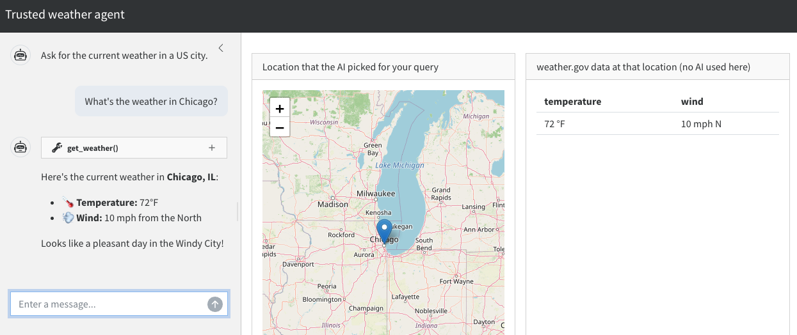
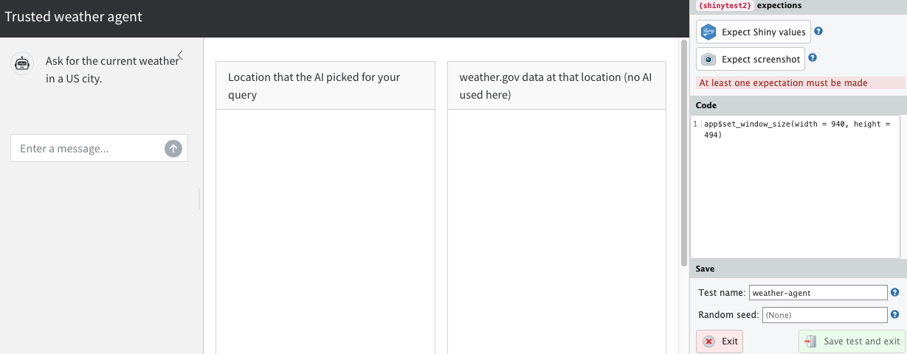
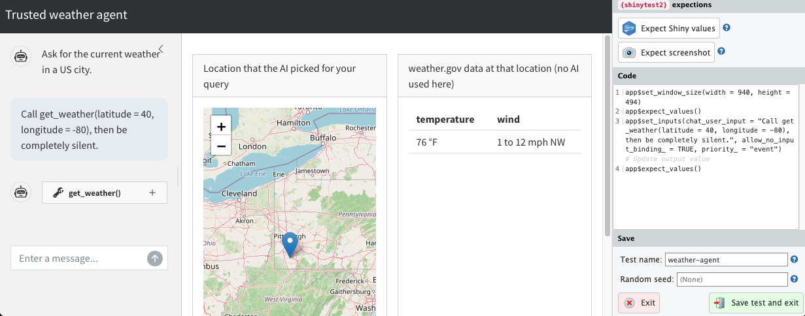

# Registering tools in a full working example {#sec-tools}

This chapter builds on the template in [the previous chapter](template.qmd) and shows how to add tools to a trusted mini-agent in a Shiny app.
We use the weather agent example from [Chapter 2](hallucinations.qmd) to make the discussion concrete.
By the end of the chapter, we will have a full working example of a trusted mini-agent.

## Overview

This is the appearance of the app we will build.



In the `shinychat` interface on the left, the user asks for the weather in a US city.
The leaflet map in the middle lets the user easily check if the LLM-generated coordinates for the city are correct.
Trustworthy weather data is displayed on the right.

It is important to emphasize how the user interface separates the untrusted LLM conversation on the left from the trusted weather data on the right.
The LLM-reported weather in the chat may be a hallucination, and the user should not rely on it.
The weather data on the right, however, is trustworthy because:

1. We guarantee it comes from a trusted tool (`get_weather()`).
1. The leaflet map in the middle is super easy to check, so we can be confident the app is checking the weather in the right place.

## App design

The following diagram demonstrates the flow of control in the weather app we are about to build.

```{mermaid}
flowchart LR
  subgraph Untrusted due to the LLM
    U["User input"] --> C["shinychat UI"]
    C --> U
    C --> L[ellmer chat]
    L --> LLM
    LLM --> L
    L --> C
  end
  subgraph Trusted due to testing
    L --> T["get_weather()"]
    T --> RV["reactiveValues:<br>lat, long, weather"]
  end
  subgraph Trusted after human oversight
    RV --> W["Weather data"]
  end
  subgraph Human oversight 
    RV --> M["leaflet map of<br>LLM-generated lat and long"]
  end
```

The user enters a prompt into the [`shinychat`](https://posit-dev.github.io/shinychat/r/) UI, and there is a flow of conversation between the user and the LLM.
At its discretion, the LLM sends [`ellmer`](https://ellmer.tidyverse.org/) the text for a tool call (e.g. `get_weather(41.8, -87.6)`), at which point [`ellmer`](https://ellmer.tidyverse.org/) runs the tool call instead of simply relaying the text back to [`shinychat`](https://posit-dev.github.io/shinychat/r/).

`get_weather()` is a function that accepts a pair of geographic coordinates and returns the location and its weather to a [`reactiveValues()`](https://shiny.posit.co/r/reference/shiny/0.11/reactivevalues.html) list.
**Crucially, `get_weather()` is the only thing that can write to those `reactiveValues()` slots.**
**This constraint enforces rule 2 (injectivity) of trusted mini-agents.**
Neither the user nor the LLM can update those reactive values any other way.

The leaflet map renders the coordinates the LLM picked, so the user can check whether the LLM's resolution of their query looks correct.
If the `get_weather()` tool is correct and the map points to the right location, then hallucinated weather data is structurally impossible.

## Weather API function

Our agent relies on an internal R function that accepts geographic coordinates and returns weather data.
This is a simple function that the agentic tool will eventually call.

```{.r}
#' @title Fetch current weather at a US location.
#' @description Fetches the current (or nearest-to-current) forecast period
#'   from the U.S. National Weather Service API
#'   (https://www.weather.gov/documentation/services-web-api). The NWS API
#'   is free, requires no API key, and only covers locations in the United
#'   States.
#' @details A two-step lookup is required:
#'     1. GET /points/{lat},{lon}  -> returns a URL for the gridded forecast
#'     2. GET that forecast URL    -> returns the forecast periods
#'   A descriptive User-Agent is required by api.weather.gov. The NWS
#'   forecast endpoint returns a sequence of upcoming periods (e.g.
#'   "This Afternoon", "Tonight", "Tomorrow"). This function selects the
#'   first period whose time window contains the current time, falling
#'   back to the earliest period if none currently apply.
#' @return A named list with the temperature and wind at the specified
#'   latitude and longitude.
#'   Throws an error if the coordinates are outside the NWS coverage area.
#' @param latitude Numeric scalar. Latitude in decimal degrees, between
#'   -90 and 90. Must be a finite number.
#' @param longitude Numeric scalar. Longitude in decimal degrees, between
#'   -180 and 180. Must be a finite number.
#' @examples
#'   # Forecast for downtown Indianapolis, IN.
#'   weather <- weather_api(latitude = 39.7684, longitude = -86.1581)
#'   str(weather)
weather_api <- function(latitude, longitude) {
  # Assertions are super important for any agent tool.
  stopifnot(
    is.numeric(latitude),
    length(latitude) == 1,
    is.finite(latitude),
    is.numeric(longitude),
    length(longitude) == 1,
    is.finite(longitude),
    latitude >= -90,
    latitude <= 90,
    longitude >= -180,
    longitude <= 180
  )
  # Mock hook for shinytest2: when MOCK_WEATHER is set, return a stable
  # fixture instead of calling the live NWS API. This keeps the snapshot
  # in `tests/testthat/_snaps/app/` deterministic across runs.
  if (nzchar(Sys.getenv("MOCK_WEATHER", unset = ""))) {
    return(list(temperature = "72 °F", wind = "5 mph SW"))
  }
  user <- "mini-agent (mini-agent; contact: noreply@example.com)"
  # Step 1: resolve the (lat, lon) to an NWS gridpoint.
  points_url <- sprintf(
    "https://api.weather.gov/points/%s,%s",
    format(latitude, digits = 4),
    format(longitude, digits = 4)
  )
  points <- httr2::request(points_url) |>
    httr2::req_user_agent(user) |>
    httr2::req_headers(Accept = "application/geo+json") |>
    httr2::req_retry(max_tries = 3) |>
    httr2::req_perform() |>
    httr2::resp_body_json()
  # Step 2: fetch the forecast periods for that gridpoint.
  forecast <- httr2::request(points$properties$forecast) |>
    httr2::req_user_agent(user) |>
    httr2::req_headers(Accept = "application/geo+json") |>
    httr2::req_retry(max_tries = 3) |>
    httr2::req_perform() |>
    httr2::resp_body_json()
  periods <- forecast$properties$periods
  # Pick the period that covers "now". NWS uses ISO 8601 with offsets,
  # which `as.POSIXct(..., format = ...)` parses correctly.
  now <- Sys.time()
  starts <- as.POSIXct(
    vapply(periods, `[[`, character(1), "startTime"),
    format = "%Y-%m-%dT%H:%M:%S%z"
  )
  ends <- as.POSIXct(
    vapply(periods, `[[`, character(1), "endTime"),
    format = "%Y-%m-%dT%H:%M:%S%z"
  )
  current_index <- which(starts <= now & ends >= now)[1]
  if (is.na(current_index)) {
    current_index <- 1L
  }
  current <- periods[[current_index]]
  city <- points$properties$relativeLocation$properties$city
  state <- points$properties$relativeLocation$properties$state
  list(
    temperature = paste0(current$temperature, " °", current$temperatureUnit),
    wind = paste(current$windSpeed, current$windDirection)
  )
}
```

## Weather tool constructor

We write `get_weather()` as an [`ellmer::tool()`](https://ellmer.tidyverse.org/reference/tool.html), but with a twist: instead of returning a tool object, we write a tool constructor that accepts a `reactiveValues()` list and instantiates a tool tied to those reactive values.
The tool can access the `values` object because `values` is inside the [closure](https://www.r-bloggers.com/2012/12/closures-in-r-a-useful-abstraction/) of the `fun` argument of `ellmer::tool()`.

```{.r}
#' @title Weather tool constructor
#' @description Create a weather tool for `ellmer`.
#' @return An `ellmer` tool object that can be registered with
#'   an `ellmer` chat object.
#' @param values A Shiny reactiveValues object with weather data.
#'   The weather tool updates Shiny outputs, and it is the ONLY thing
#'   that can update these outputs.
#'   This restriction is essential for a trusted mini-agent.
new_weather_tool <- function(values) {
  ellmer::tool(
    fun = function(latitude, longitude) {
      values$weather <- weather_api(latitude, longitude)
      values$latitude <- latitude
      values$longitude <- longitude
      ellmer::ContentToolResult(jsonlite::toJSON(values$weather))
    },
    name = "get_weather",
    description = paste(
      "Get the current weather forecast for a location in the United States,",
      "given its latitude and longitude in decimal degrees.",
      "The tool only approximates the current weather,",
      "not past weather or distant future forecasts.",
      "Only call this tool for U.S. locations.",
      "The underlying National Weather Service API does not",
      "cover other countries."
    ),
    arguments = list(
      latitude = ellmer::type_number(
        "Latitude in decimal degrees. Must be between -90 and 90."
      ),
      longitude = ellmer::type_number(
        "Longitude in decimal degrees. Must be between -180 and 180."
      )
    )
  )
}
```

## Leaflet map

The leaflet map helps the user check the correctness of LLM-generated location data.
It accepts geographic coordinates and renders a map with a pin dropped at that location.

```{.r}
#' @title Build a leaflet map centered on a US location.
#' @description Construct an OpenStreetMap-tiled `leaflet` widget centered
#'   on the supplied latitude and longitude with a single marker dropped at
#'   that point. Used by the trusted weather agent app to let users
#'   visually verify that the AI-resolved coordinates land in the region
#'   they asked about.
#' @details Character inputs are coerced to numeric so the function can be
#'   called directly with reactive values pulled from a Shiny session.
#' @return A `leaflet` htmlwidget (S3 classes `c("leaflet", "htmlwidget")`)
#'   suitable for passing to `leaflet::renderLeaflet()` or printing in an
#'   interactive R session. The widget contains an OpenStreetMap tile
#'   layer, a `setView()` directive at the requested zoom, and a single
#'   marker whose popup displays the coordinates rounded to four decimal
#'   places.
#' @param latitude Numeric (or character coercible to numeric) scalar.
#'   Latitude in decimal degrees, between -90 and 90.
#' @param longitude Numeric (or character coercible to numeric) scalar.
#'   Longitude in decimal degrees, between -180 and 180.
#' @param zoom Integer scalar. Leaflet zoom level: lower values are zoomed
#'   further out, higher values are zoomed in tighter.
#' @examples
#'   # Drop a pin on downtown Indianapolis, IN.
#'   leaflet_map(latitude = 39.7684, longitude = -86.1581)
leaflet_map <- function(latitude, longitude, zoom = 6) {
  latitude <- as.numeric(latitude)
  longitude <- as.numeric(longitude)
  leaflet::leaflet() |>
    leaflet::addTiles() |>
    leaflet::setView(lng = longitude, lat = latitude, zoom = zoom) |>
    leaflet::addMarkers(
      lng = longitude,
      lat = latitude,
      popup = sprintf("%.4f, %.4f", latitude, longitude)
    )
}
```

## Chat constructor with tool registration

As before, we write a constructor for the `ellmer` chat object.
This time, however, there is an extra step to create a new weather tool with a given set of reactive values, then register the new tool with the chat object.

```{.r}
new_chat <- function(values) {
  chat <- ellmer::chat_anthropic(
    system_prompt = paste(
      "You are a concise assistant that knows how to translate vague",
      "location information into latitude and longitude coordinates."
    )
  )
  chat$register_tool(new_weather_tool(values))
  chat
}
```

## App UI

The app UI has three main components: an untrusted `shinychat` UI for the conversation, a `leaflet` output for the map for human review, and a trusted table output for the weather data.
**Remember: because of the three levels of trust, these components should be in separate UI elements.**
It should be clear to the user that trusted output comes from the weather table, not from the chat.

```{.r}
ui <- bslib::page_sidebar(
  title = "Trusted weather agent",
  theme = bslib::bs_theme(bootswatch = "cosmo"),
  sidebar = bslib::sidebar(
    width = "30vw",
    style = "height: 100%; padding-top: 15px; overflow-x: hidden;",
    shinychat::chat_ui(
      "chat",
      messages = "Ask for the current weather in a US city."
    )
  ),
  bslib::layout_columns(
    bslib::card(
      bslib::card_header("Location that the AI picked for your query"),
      bslib::card_body(
        leaflet::leafletOutput("location", height = "300px")
      )
    ),
    bslib::card(
      bslib::card_header("weather.gov data at that location (no AI used here)"),
      bslib::card_body(
        shiny::tableOutput("weather")
      )
    )
  )
)
```

## Server function

The server function defines the reactive values for the weather results and geographic coordinates.
The chat object is lazily created with the given reactive values list, and there are reactive expressions for the chat, leaflet map, and weather data.

```{.r}
server <- function(input, output, session) {
  values <- shiny::reactiveValues(
    weather = NULL,
    latitude = NULL,
    longitude = NULL
  )
  delayedAssign(x = "chat", value = new_chat(values))
  shiny::observeEvent(input$chat_user_input, {
    stream <- chat$stream_async(input$chat_user_input, stream = "content")
    shinychat::chat_append("chat", stream)
  })
  output$location <- leaflet::renderLeaflet({
    req(values$latitude, values$longitude)
    leaflet_map(latitude = values$latitude, longitude = values$longitude)
  })
  output$weather <- shiny::renderTable({
    req(values$weather)
    as.data.frame(values$weather)
  })
}

shiny::shinyApp(ui, server)
```

## Complete app code

Here is the full code for the app.

```{.r filename="app.R"}
#' @title Fetch current weather at a US location.
#' @description Fetches the current (or nearest-to-current) forecast period
#'   from the U.S. National Weather Service API
#'   (https://www.weather.gov/documentation/services-web-api). The NWS API
#'   is free, requires no API key, and only covers locations in the United
#'   States.
#' @details A two-step lookup is required:
#'     1. GET /points/{lat},{lon}  -> returns a URL for the gridded forecast
#'     2. GET that forecast URL    -> returns the forecast periods
#'   A descriptive User-Agent is required by api.weather.gov. The NWS
#'   forecast endpoint returns a sequence of upcoming periods (e.g.
#'   "This Afternoon", "Tonight", "Tomorrow"). This function selects the
#'   first period whose time window contains the current time, falling
#'   back to the earliest period if none currently apply.
#' @return A named list with the temperature and wind at the specified
#'   latitude and longitude.
#'   Throws an error if the coordinates are outside the NWS coverage area.
#' @param latitude Numeric scalar. Latitude in decimal degrees, between
#'   -90 and 90. Must be a finite number.
#' @param longitude Numeric scalar. Longitude in decimal degrees, between
#'   -180 and 180. Must be a finite number.
#' @examples
#'   # Forecast for downtown Indianapolis, IN.
#'   weather <- weather_api(latitude = 39.7684, longitude = -86.1581)
#'   str(weather)
weather_api <- function(latitude, longitude) {
  # Assertions are super important for any agent tool.
  stopifnot(
    is.numeric(latitude),
    length(latitude) == 1,
    is.finite(latitude),
    is.numeric(longitude),
    length(longitude) == 1,
    is.finite(longitude),
    latitude >= -90,
    latitude <= 90,
    longitude >= -180,
    longitude <= 180
  )
  # Mock hook for shinytest2: when MOCK_WEATHER is set, return a stable
  # fixture instead of calling the live NWS API. This keeps the snapshot
  # in `tests/testthat/_snaps/app/` deterministic across runs.
  if (nzchar(Sys.getenv("MOCK_WEATHER", unset = ""))) {
    return(list(temperature = "72 °F", wind = "5 mph SW"))
  }
  user <- "mini-agent (mini-agent; contact: noreply@example.com)"
  # Step 1: resolve the (lat, lon) to an NWS gridpoint.
  points_url <- sprintf(
    "https://api.weather.gov/points/%s,%s",
    format(latitude, digits = 4),
    format(longitude, digits = 4)
  )
  points <- httr2::request(points_url) |>
    httr2::req_user_agent(user) |>
    httr2::req_headers(Accept = "application/geo+json") |>
    httr2::req_retry(max_tries = 3) |>
    httr2::req_perform() |>
    httr2::resp_body_json()
  # Step 2: fetch the forecast periods for that gridpoint.
  forecast <- httr2::request(points$properties$forecast) |>
    httr2::req_user_agent(user) |>
    httr2::req_headers(Accept = "application/geo+json") |>
    httr2::req_retry(max_tries = 3) |>
    httr2::req_perform() |>
    httr2::resp_body_json()
  periods <- forecast$properties$periods
  # Pick the period that covers "now". NWS uses ISO 8601 with offsets,
  # which `as.POSIXct(..., format = ...)` parses correctly.
  now <- Sys.time()
  starts <- as.POSIXct(
    vapply(periods, `[[`, character(1), "startTime"),
    format = "%Y-%m-%dT%H:%M:%S%z"
  )
  ends <- as.POSIXct(
    vapply(periods, `[[`, character(1), "endTime"),
    format = "%Y-%m-%dT%H:%M:%S%z"
  )
  current_index <- which(starts <= now & ends >= now)[1]
  if (is.na(current_index)) {
    current_index <- 1L
  }
  current <- periods[[current_index]]
  city <- points$properties$relativeLocation$properties$city
  state <- points$properties$relativeLocation$properties$state
  list(
    temperature = paste0(current$temperature, " °", current$temperatureUnit),
    wind = paste(current$windSpeed, current$windDirection)
  )
}

#' @title Weather tool constructor
#' @description Create a weather tool for `ellmer`.
#' @return An `ellmer` tool object that can be registered with
#'   an `ellmer` chat object.
#' @param values A Shiny reactiveValues object with weather data.
#'   The weather tool updates Shiny outputs, and it is the ONLY thing
#'   that can update these outputs.
#'   This restriction is essential for a trusted mini-agent.
new_weather_tool <- function(values) {
  ellmer::tool(
    fun = function(latitude, longitude) {
      values$weather <- weather_api(latitude, longitude)
      values$latitude <- latitude
      values$longitude <- longitude
      ellmer::ContentToolResult(jsonlite::toJSON(values$weather))
    },
    name = "get_weather",
    description = paste(
      "Get the current weather forecast for a location in the United States,",
      "given its latitude and longitude in decimal degrees.",
      "The tool only approximates the current weather,",
      "not past weather or distant future forecasts.",
      "Only call this tool for U.S. locations.",
      "The underlying National Weather Service API does not",
      "cover other countries."
    ),
    arguments = list(
      latitude = ellmer::type_number(
        "Latitude in decimal degrees. Must be between -90 and 90."
      ),
      longitude = ellmer::type_number(
        "Longitude in decimal degrees. Must be between -180 and 180."
      )
    )
  )
}

#' @title Build a leaflet map centered on a US location.
#' @description Construct an OpenStreetMap-tiled `leaflet` widget centered
#'   on the supplied latitude and longitude with a single marker dropped at
#'   that point. Used by the trusted weather agent app to let users
#'   visually verify that the AI-resolved coordinates land in the region
#'   they asked about.
#' @details Character inputs are coerced to numeric so the function can be
#'   called directly with reactive values pulled from a Shiny session.
#' @return A `leaflet` htmlwidget (S3 classes `c("leaflet", "htmlwidget")`)
#'   suitable for passing to `leaflet::renderLeaflet()` or printing in an
#'   interactive R session. The widget contains an OpenStreetMap tile
#'   layer, a `setView()` directive at the requested zoom, and a single
#'   marker whose popup displays the coordinates rounded to four decimal
#'   places.
#' @param latitude Numeric (or character coercible to numeric) scalar.
#'   Latitude in decimal degrees, between -90 and 90.
#' @param longitude Numeric (or character coercible to numeric) scalar.
#'   Longitude in decimal degrees, between -180 and 180.
#' @param zoom Integer scalar. Leaflet zoom level: lower values are zoomed
#'   further out, higher values are zoomed in tighter.
#' @examples
#'   # Drop a pin on downtown Indianapolis, IN.
#'   leaflet_map(latitude = 39.7684, longitude = -86.1581)
leaflet_map <- function(latitude, longitude, zoom = 6) {
  latitude <- as.numeric(latitude)
  longitude <- as.numeric(longitude)
  leaflet::leaflet() |>
    leaflet::addTiles() |>
    leaflet::setView(lng = longitude, lat = latitude, zoom = zoom) |>
    leaflet::addMarkers(
      lng = longitude,
      lat = latitude,
      popup = sprintf("%.4f, %.4f", latitude, longitude)
    )
}

new_chat <- function(values) {
  chat <- ellmer::chat_anthropic(
    system_prompt = paste(
      "You are a concise assistant that knows how to translate vague",
      "location information into latitude and longitude coordinates."
    )
  )
  chat$register_tool(new_weather_tool(values))
  chat
}

ui <- bslib::page_sidebar(
  title = "Trusted weather agent",
  theme = bslib::bs_theme(bootswatch = "cosmo"),
  sidebar = bslib::sidebar(
    width = "30vw",
    style = "height: 100%; padding-top: 15px; overflow-x: hidden;",
    shinychat::chat_ui(
      "chat",
      messages = "Ask for the current weather in a US city."
    )
  ),
  bslib::layout_columns(
    bslib::card(
      bslib::card_header("Location that the AI picked for your query"),
      bslib::card_body(
        leaflet::leafletOutput("location", height = "300px")
      )
    ),
    bslib::card(
      bslib::card_header("weather.gov data at that location (no AI used here)"),
      bslib::card_body(
        shiny::tableOutput("weather")
      )
    )
  )
)

server <- function(input, output, session) {
  values <- shiny::reactiveValues(
    weather = NULL,
    latitude = NULL,
    longitude = NULL
  )
  delayedAssign(x = "chat", value = new_chat(values))
  shiny::observeEvent(input$chat_user_input, {
    stream <- chat$stream_async(input$chat_user_input, stream = "content")
    shinychat::chat_append("chat", stream)
  })
  output$location <- leaflet::renderLeaflet({
    req(values$latitude, values$longitude)
    leaflet_map(latitude = values$latitude, longitude = values$longitude)
  })
  output$weather <- shiny::renderTable({
    req(values$weather)
    as.data.frame(values$weather)
  })
}

shiny::shinyApp(ui, server)
```

## Testing

We use expectation-based testing to ensure the app works.
We do not cover every possible test here, but we demonstrate the most important ones covering the tool function and the app itself.

We begin with the `weather_api()` function.
The weather changes over time, but we can still test that the function returns data in the expected format and that it correctly handles invalid input.
Examples:

```{.r filename="tests/testthat/test-weather_api.R"}
test_that("weather_api() returns a sensible response from the live NWS API", {
  skip_on_cran()
  skip_if_offline(host = "api.weather.gov")
  weather <- weather_api(latitude = 39.7684, longitude = -86.1581)
  expect_match(weather$temperature, "^-?[0-9]+ °[FC]$")
  temperature_value <- as.numeric(sub(" °[FC]$", "", weather$temperature))
  expect_gte(temperature_value, -40)
  expect_lte(temperature_value, 130)
  expect_match(weather$wind, "mph")
})

test_that("weather_api() rejects invalid coordinates", {
  expect_error(weather_api(latitude = "39", longitude = -86))
  expect_error(weather_api(latitude = 39, longitude = "abc"))
  expect_error(weather_api(latitude = 91, longitude = 0))
  expect_error(weather_api(latitude = -91, longitude = 0))
  expect_error(weather_api(latitude = 0, longitude = 181))
  expect_error(weather_api(latitude = 0, longitude = -181))
  expect_error(weather_api(latitude = NA_real_, longitude = 0))
  expect_error(weather_api(latitude = c(39, 40), longitude = -86))
})
```

The weather is always changing, so `weather_api()` will return different values at different times.
This poses a problem for other types of tests, which is why `weather_api()` has an environment variable that lets us mock the API response with a stable fixture::

```{.r filename="app.R"}
  # Mock hook for shinytest2: when MOCK_WEATHER is set, return a stable
  # fixture instead of calling the live NWS API. This keeps the snapshot
  # in `tests/testthat/_snaps/app/` deterministic across runs.
  if (nzchar(Sys.getenv("MOCK_WEATHER", unset = ""))) {
    return(list(temperature = "72 °F", wind = "5 mph SW"))
  }
```

To test the mocking, we write:

```{.r filename="tests/testthat/test-weather_api.R"}
test_that("weather_api() returns mocked fixture when MOCK_WEATHER is set", {
  withr::local_envvar(MOCK_WEATHER = "true")
  weather <- weather_api(latitude = 39.7684, longitude = -86.1581)
  expect_equal(weather, list(temperature = "72 °F", wind = "5 mph SW"))
})
```

Mocking allows us to test the rest of the app in a near-deterministic way with `shinytest2`.
To set up the test:

* Set the `MOCK_WEATHER` environment variable.
* Run `shinytest2::record_test()`. A browser window will launch:



* Click "Expect Shiny values".
* Enter the prompt "Call get_weather(latitude = 40, longitude = -80), then be completely silent."
This tests the end-to-end flow of the LLM interaction, the tool calling and Shiny output. The LLM may hallucinate, but if it does, the test failure will be obvious and can simply be retried.
* If a pop-up prompts you to record updates, click "Record".
* After the leaflet app and weather data table populate, click "Expect Shiny values" again.
Your window should now look like this:



* Click "Save test and exit" on the lower right-hand side.

This creates a test file in `tests/testthat/` and a snapshot in `tests/testthat/_snaps/`.
Now, open the file in `tests/testthat/`.
Edit the file to:

1. Set `MOCK_WEATHER` at the beginning of the test code.
2. To avoid race conditions with LLM streaming, add `app$wait_for_idle()` before each call to `app$expect_values()`.

Example:

```{.r filename="tests/testthat/test-app.R"}
test_that("test the app", {
  withr::local_envvar(MOCK_WEATHER = "true")
  app <- AppDriver$new(
    test_path("../.."),
    name = "app",
    height = 929,
    width = 1619
  )
  app$wait_for_idle()
  app$expect_values()
  app$set_inputs(
    chat_user_input = paste(
      "Call get_weather(latitude = 40, longitude = -80),",
      "then be completely silent."
    ),
    allow_no_input_binding_ = TRUE,
    priority_ = "event"
  )
  app$wait_for_idle()
  app$expect_values()
})
```

To test the entire app, run `shinytest2::test_app()` from the root directory of the app.
The tests require authentication into the LLM, but they can run without a browser in a noninteractive R session.

```{.r}
> shinytest2::test_app()
Loading required package: testthat
✔ | F W  S  OK | Context
✔ |          2 | app [7.1s]
✔ |         13 | weather_api

══ Results ════════════════════════════════════════════════
Duration: 7.5 s

[ FAIL 0 | WARN 0 | SKIP 0 | PASS 15 ]
```
